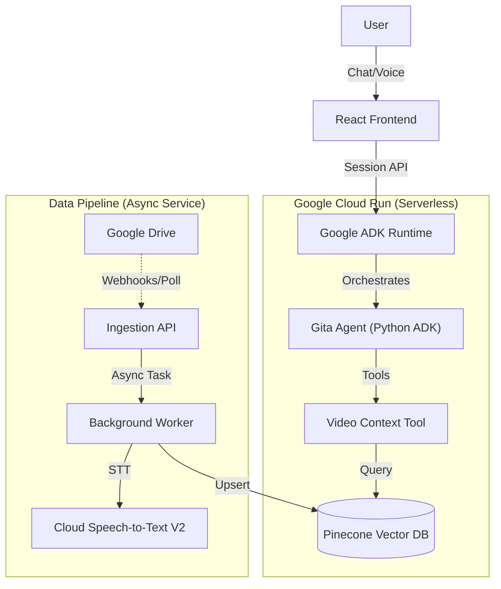

# Technical Design: Hinduism & Bhagavad Gita Agent

## 1. Executive Summary
An AI agent designed to answer natural language queries about Hinduism, specifically the Bhagavad Gita, utilizing personal video context via Model Context Protocol (MCP).

## 2. System Architecture

### High-Level Architecture (Google ADK)


### Architecture Clarification: The "Async" Pipeline
**Why Pub/Sub (or Async Queues)?**
Video processing is **slow**. A 1-hour video takes minutes to transcribe. If we run this directly in the API call (`POST /ingest`), the request will time out (HTTP limit is usually 60s).
-   **Design**: The API acknowledges the request ("Job Created") immediately.
-   **Execution**: A background worker picks up the job and crunches the video without blocking the user.
-   **Component**: For the MVP, this can be a single Python Service using `BackgroundTasks` in FastAPI. For scale, we use Google Cloud Tasks.

### Selected Framework: Google ADK (Python)
We will use the **Google Agent Development Kit (ADK)**.
-   **Why?**: Native integration with Google Gemini, built-in "Agent Runtime".
-   **Setup Instructions**:
    1.  Install the CLI: `pip install google-adk`
    2.  Initialize Project: `adk create my-gita-agent` (Follows standard structure: `agent.py`, `requirements.txt`).
    3.  Define Agent: Update `agent.py` to use `model="gemini-1.5-pro"` and import our MCP tools.
    4.  Run Locally: `adk run` for interactive testing.
    *Reference: [Google ADK Python Guide](https://google.github.io/adk-docs/get-started/python/)*

### System Components
1.  **Frontend**: React + Tailwind (Talks to ADK Runtime API).
2.  **Runtime**: ADK Service handling history, state, and user sessions.
3.  **Data Pipeline**: A dedicated Microservice (FastAPI) for processing videos.

## 3. Data Processing Pipeline: Deep Dive
*Goal: Robust, observable video ingestion.*

### Ingestion Service API Definitions
*Handles Video Content (Google Meet Recordings).*
This service accepts video files, extracts the audio track, and discards the visual data to optimize processing.

**Endpoint 1: Trigger Ingestion**
-   `POST /api/v1/ingest`
-   **Request**: 
    ```json
    { 
      "source_folder_id": "1hWMR...", 
      "file_types": ["mp4", "mov"],
      "force_reindex": false 
    }
    ```
-   **Logic**: Scans folder for **Video Files**, downloads them, uses `ffmpeg` to strip audio, then proceeds to transcription.

**Endpoint 2: Check Status**
-   `GET /api/v1/jobs/{job_id}`
-   **Response**: 
    ```json
    {
      "status": "processing",
      "progress": 45,
      "current_step": "transcription",
      "file": "lesson_01.mp4"
    }
    ```

### Technical Deep Dive: Transcription Strategy
**Service**: **Google Cloud Speech-to-Text V2 API**.
**Library**: `google-cloud-speech` (Python Client).

**Why this service?**
It is a fully managed API. We do not need to run our own Whisper models (which requires GPU management). It integrates natively with GCS (where our audio files live).

**Configuration**:
-   **Model**: `chirp_2` (Best for "spontaneous speech" and mixed languages like Hindi/English).
-   **Features**:
    -   `enable_word_time_offsets`: True (Timestamps for every word).
    -   `diarization_config`: `{ "min_speaker_count": 1, "max_speaker_count": 3 }` (Distinguish Guru vs Student).
-   **Flow**:
    1.  **Extract**: `ffmpeg-python` strips audio from MP4 -> Upload to GCS bucket.
    2.  **Transcribe**: Python code calls `BatchRecognizeRequest` pointing to the GCS URI.
    3.  **Poll**: The worker waits for the "Long Running Operation" (LRO) to complete.
    4.  **Parse**: Download JSON result, grouping words by Speaker Label.

### Technical Deep Dive: Vector Database (Pinecone)
*Why Pinecone?*
-   **Indexing**: Uses **HNSW (Hierarchical Navigable Small World)** graphs. Think of it as a multi-layered highway system for data. It can find the "nearest neighbor" (most similar meaning) among millions of vectors in milliseconds without checking every single one.
-   **Serverless**: We specifically use the Serverless tier which decouples storage from compute. Checkpointing is automatic.

## 4. MCP Integration Strategy
*Decoupling data fetch from reasoning.*

### Implementation: MCP Python SDK
We will use the official `modelcontextprotocol` Python SDK.
*Repo: [https://github.com/modelcontextprotocol/python-sdk](https://github.com/modelcontextprotocol/python-sdk)*

### Server Specification
-   **Name**: `gita-context-server`
-   **Setup**: `pip install mcp`
-   **Code Structure**:
    ```python
    from mcp.server import Server
    import mcp.types as types

    app = Server("gita-context-server")

    @app.call_tool()
    async def call_tool(name: str, arguments: dict) -> list[types.TextContent]:
        if name == "search_transcripts":
            # Logic to query Pinecone
            return [types.TextContent(type="text", text="...")]
    ```
    1.  `search_transcripts(query: str, limit: int = 5)`
        -   **Input**: Natural language query (e.g., "What is the nature of the soul?").
        -   **Logic**: Encodes query -> Pinecone Similarity Search -> Returns Top K chunks with timestamps.
    2.  `get_video_metadata(video_id: str)`
        -   **Input**: Video ID.
        -   **Logic**: Returns title, date, and summary (if available).

## 5. Deployment Architecture: Cloud Run (Serverless)
*Why this is the right choice for your needs.*

### What is "Serverless"?
In a traditional setup, you rent a computer (VM) that runs 24/7, costing money even when no one uses it. You also have to update linux, manage firewalls, etc.
**Serverless (Google Cloud Run)** abstracts the machine away. You give Google your code (in a Docker container), and they run it only when a request comes in.

### Benefits for this Project
1.  **Cost Efficiency (Scale to Zero)**: If no one asks a question for a week, your compute bill is **$0**. usage is billed by the millisecond.
2.  **Zero Maintenance**: No OS patches or server restarts. Google handles the infrastructure.
3.  **Simplicity**: Deployment is just one command (`gcloud run deploy`).

### Architecture Update for Serverless
Since Cloud Run is "stateless" (files created disappear after the web request ends), we cannot store the Vector Database files *inside* the running container permanently.
*Adjustment*: For a truly serverless MVP, we have two paths:
1.  **Managed Vector DB (Pinecone)**: Use the **Free Tier**. It connects via API, so your Cloud Run service remains stateless. **(Recommended for ease)**.
2.  **Chroma + GCS**: The service downloads the database from Google Cloud Storage on startup. (Slower cold-starts).

### Component View
-   **Agent Service (Cloud Run)**: Runs FastAPI + LangChain.
-   **Database (Pinecone)**: External persistent memory (Free Tier supports ~100k vectors, plenty for 6hrs video).
-   **Ingestion (Local/Script)**: You run a script on your laptop to process videos -> upload vectors to Pinecone.

## 6. Frontend
*Goal: Simple, high-quality Web UI.*

-   **Type**: Single Page Application (SPA).
-   **Stack**: React + Vite + TailwindCSS (Standard modern web stack).
-   **Design**: Clean, minimalist interface.
    -   **Hero Section**: Simple greeting ("Ask about the Gita").
    -   **Chat Interface**: Standard message bubble layout.
    -   **Citation Panel**: When the agent cites a video, it appears as a clickable source that (optionally) plays the clip.
-   **Deploy**: Static hosting (Firebase Hosting or GCS Bucket) talking to the Cloud Run Backend.

## 7. Testing Strategy: Robustness Focus

### Unit & Integration
-   **PyTest**: Standard runner.
-   **Golden Set**: 20 QA pairs verified by human (you).

### Validation Strategy (Bad Data)
We must ensure the pipeline doesn't crash on corrupted inputs.
1.  **Corrupt MP4s**: Pipeline detects invalid headers and marks job as `failed` (not `crashed`).
2.  **Silence/Noise**: If an audio track is 100% silence, STT returns empty. Pipeline should log warning and skip embedding.

### Fuzz Testing (New)
*Goal: Bombard the API with random inputs to find edge cases.*
-   **Tool**: `hypothesis` library for Python.
-   **Strategy**:
    -   Generate random JSON payloads for `POST /ingest`.
    -   Generate malformed `job_id` strings for `GET /status`.
    -   **Text Fuzzing**: Send queries with emojis, 100k characters, or SQL injection patterns to the ADK agent to ensure it handles them gracefully (sanitization).
