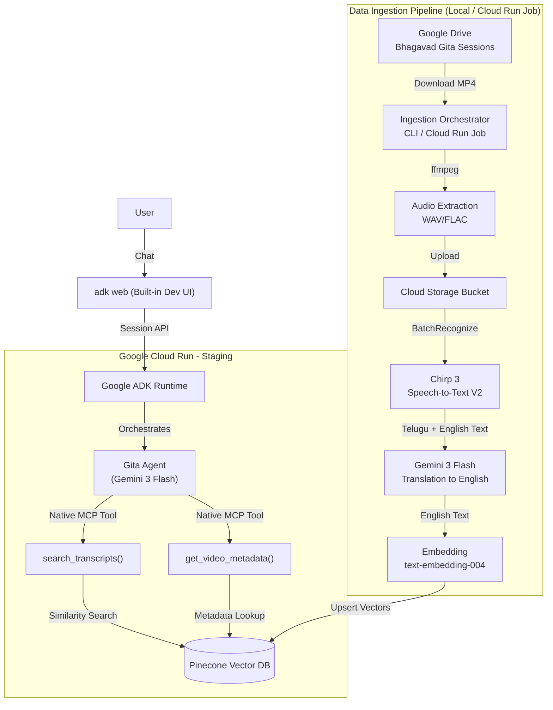
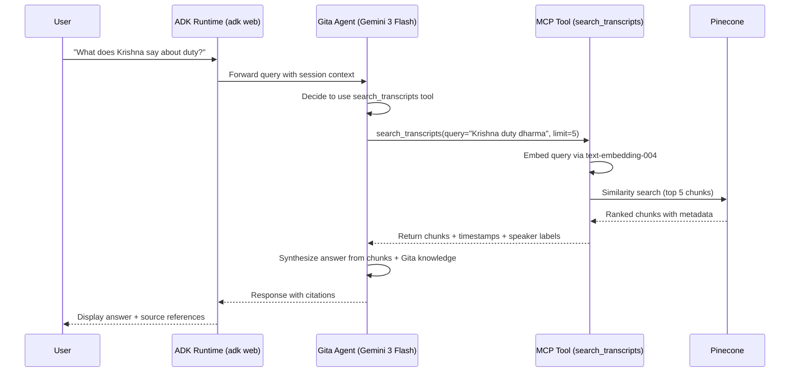
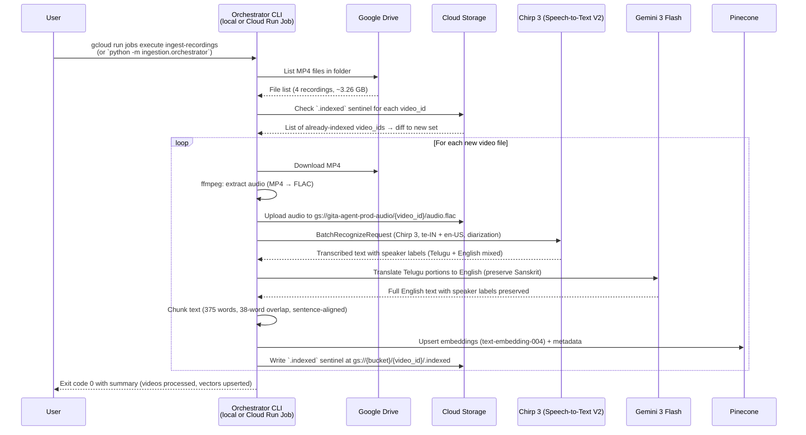
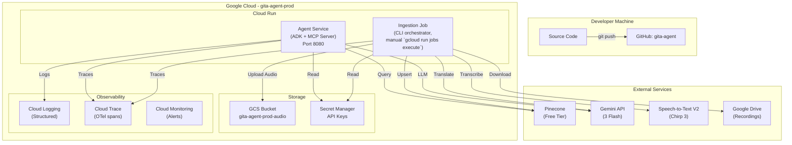

# Technical Design: Hinduism & Bhagavad Gita Agent

## 1. Executive Summary

An AI agent designed to answer natural language queries about Hinduism, specifically the Bhagavad Gita, utilizing personal video context from recorded sessions between a father ("Nanna" / Guru) and daughter (Udaya / Student). The agent is built on **Google Agent Development Kit (ADK)** with **Gemini 3 Flash**, uses a two-stage translation pipeline (**Chirp 3** for Telugu/English transcription + **Gemini** for English translation), stores context as vector embeddings in **Pinecone**, and exposes transcript search via a native **MCP tool** integrated directly into the ADK agent. The MVP frontend is the built-in **`adk web`** development UI.

---

## 2. System Architecture

### 2.1 High-Level Architecture


```mermaid
graph TD
    User[User] -->|Chat| ADKWEB["adk web (Built-in Dev UI)"]
    ADKWEB -->|Session API| Runtime[Google ADK Runtime]

    subgraph "Google Cloud Run - Staging"
        Runtime -->|Orchestrates| Agent["Gita Agent<br/>(Gemini 3 Flash)"]
        Agent -->|Native MCP Tool| MCPTool["search_transcripts()"]
        Agent -->|Native MCP Tool| MCPMeta["get_video_metadata()"]
        MCPTool -->|Similarity Search| VDB[(Pinecone Vector DB)]
        MCPMeta -->|Metadata Lookup| VDB
    end

    subgraph "Data Ingestion Pipeline (Local / Cloud Run Job)"
        Drive[Google Drive<br/>Bhagavad Gita Sessions] -->|Download MP4| Ingest[Ingestion Orchestrator<br/>CLI / Cloud Run Job]
        Ingest -->|ffmpeg| Audio[Audio Extraction<br/>WAV/FLAC]
        Audio -->|Upload| GCS[Cloud Storage Bucket]
        GCS -->|BatchRecognize| STT[Chirp 3<br/>Speech-to-Text V2]
        STT -->|Telugu + English Text| Trans[Gemini 3 Flash<br/>Translation to English]
        Trans -->|English Text| Embed[Embedding<br/>text-embedding-004]
        Embed -->|Upsert Vectors| VDB
    end
```

### 2.2 Agent Query Flow


```mermaid
sequenceDiagram
    participant U as User
    participant ADK as ADK Runtime (adk web)
    participant Agent as Gita Agent (Gemini 3 Flash)
    participant MCP as MCP Tool (search_transcripts)
    participant P as Pinecone

    U->>ADK: "What does Krishna say about duty?"
    ADK->>Agent: Forward query with session context
    Agent->>Agent: Decide to use search_transcripts tool
    Agent->>MCP: search_transcripts(query="Krishna duty dharma", limit=5)
    MCP->>MCP: Embed query via text-embedding-004
    MCP->>P: Similarity search (top 5 chunks)
    P-->>MCP: Ranked chunks with metadata
    MCP-->>Agent: Return chunks + timestamps + speaker labels
    Agent->>Agent: Synthesize answer from chunks + Gita knowledge
    Agent-->>ADK: Response with citations
    ADK-->>U: Display answer + source references
```

### 2.3 Data Ingestion Pipeline Flow


```mermaid
sequenceDiagram
    participant U as User
    participant CLI as Orchestrator CLI<br/>(local or Cloud Run Job)
    participant GD as Google Drive
    participant GCS as Cloud Storage
    participant STT as Chirp 3 (Speech-to-Text V2)
    participant LLM as Gemini 3 Flash
    participant P as Pinecone

    U->>CLI: gcloud run jobs execute ingest-recordings<br/>(or `python -m ingestion.orchestrator`)

    CLI->>GD: List MP4 files in folder
    GD-->>CLI: File list (4 recordings, ~3.26 GB)
    CLI->>GCS: Check `.indexed` sentinel for each video_id
    GCS-->>CLI: List of already-indexed video_ids → diff to new set

    loop For each new video file
        CLI->>GD: Download MP4
        CLI->>CLI: ffmpeg: extract audio (MP4 → FLAC)
        CLI->>GCS: Upload audio to gs://gita-agent-prod-audio/{video_id}/audio.flac
        CLI->>STT: BatchRecognizeRequest (Chirp 3, te-IN + en-US, diarization)
        STT-->>CLI: Transcribed text with speaker labels (Telugu + English mixed)
        CLI->>LLM: Translate Telugu portions to English (preserve Sanskrit)
        LLM-->>CLI: Full English text with speaker labels preserved
        CLI->>CLI: Chunk text (375 words, 38-word overlap, sentence-aligned)
        CLI->>P: Upsert embeddings (text-embedding-004) + metadata
        CLI->>GCS: Write `.indexed` sentinel at gs://{bucket}/{video_id}/.indexed
    end

    CLI-->>U: Exit code 0 with summary (videos processed, vectors upserted)
```

Run completion is observed via the exit code, Cloud Run Job execution status (`gcloud run jobs executions list`), and Cloud Trace spans — not via an HTTP status endpoint. The GCS `.indexed` sentinel is the durable record of which videos are fully ingested.

### 2.4 Architecture Decisions

| Decision | Choice | Rationale |
|----------|--------|-----------|
| Agent Framework | Google ADK (Python) v1.0+ | Native Gemini integration, built-in runtime, MCP support |
| Agent Model | Gemini 3 Flash | Fast, cost-effective, strong reasoning for personal use |
| Transcription | Chirp 3 (Speech-to-Text V2) | Best multilingual ASR, diarization, auto language detection |
| Translation | Gemini 3 Flash | Handles Telugu→English naturally, preserves context |
| Vector DB | Pinecone (Serverless, Free Tier) | Managed, stateless access, ~100k vectors sufficient |
| Embedding Model | text-embedding-004 | Google's latest, 768 dimensions, multilingual |
| Frontend (MVP) | `adk web` built-in UI | Zero frontend code, instant chat interface |
| Deployment | Cloud Run (Staging) | Scale-to-zero, personal use, cost-efficient |
| Secrets | Google Secret Manager | Native Cloud Run integration |

---

## 3. Data Processing Pipeline: Deep Dive

*Goal: Robust, observable pipeline that converts Telugu/English video recordings into searchable English text embeddings.*

### 3.1 Source Data

| Recording | Date | Size | Format |
|-----------|------|------|--------|
| Nanna / Udaya - 2025/07/06 14:22 EDT | Jul 6, 2025 | 1 GB | MP4 (Google Meet) |
| Nanna / Udaya - 2025/07/20 19:57 EDT | Jul 20, 2025 | 640.9 MB | MP4 (Google Meet) |
| Nanna / Udaya - 2025/08/03 18:59 EDT | Aug 3, 2025 | 668.3 MB | MP4 (Google Meet) |
| Nanna / Udaya - 2025/08/17 12:05 EDT | Aug 17, 2025 | 952 MB | MP4 (Google Meet) |

**Total**: 4 recordings, ~3.26 GB, two speakers (Nanna = Guru, Udaya = Student), Telugu/English code-switching.

**Google Drive Folder ID**: `1hWMRJRvw5di8WF7WpDPH1a311FAIpbPA`

### 3.2 Ingestion Orchestrator (CLI + Cloud Run Job)

**Pattern**: CLI orchestrator deployed as a Cloud Run **Job** (not a Service). Pivoted from the original FastAPI plan on 2026-05-24 — see `docs/technology_decisions.md` § 8 for the rationale (BackgroundTasks + in-memory state don't survive scale-to-zero; the agent never triggers ingestion, the user does).

**Entry point**: `python -m ingestion.orchestrator` — same code path locally and inside the Cloud Run Job container. The Job container's `ENTRYPOINT` is exactly this command.

**Trigger options**:

| Trigger | Use case | Command |
|---|---|---|
| Local CLI | Development, debugging, one-off re-process | `python -m ingestion.orchestrator` |
| Manual Cloud Run Job | "I uploaded a new recording, ingest it" | `gcloud run jobs execute ingest-recordings --region=us-central1 --wait` |
| Cloud Scheduler (future) | Nightly diff + ingest | Cron → Cloud Run Job |

**CLI flags**:
```
python -m ingestion.orchestrator [options]

  (default)            Scan Drive folder, diff against GCS sentinels, process new videos
  --video-id VIDEO_ID  Process a single video (skip the scan/diff)
  --force-reindex      Re-process even if `.indexed` sentinel exists
  --dry-run            Print what would be processed; do not download/upload/upsert
```

**Pipeline steps** (per video):
1. Drive download (MP4 → local `/tmp`)
2. Audio extract (MP4 → mono 16kHz FLAC via ffmpeg)
3. GCS upload (FLAC → `gs://{bucket}/{video_id}/audio.flac`)
4. Chirp 3 BatchRecognize (LRO with polling; output to `gs://{bucket}/{video_id}/transcript/`)
5. Gemini translation (with Cloud Translation V3 fallback)
6. Chunk + embed + Pinecone upsert
7. **Sentinel write**: `gs://{bucket}/{video_id}/.indexed` — only after step 6 reports `total_vectors_upserted > 0`

The sentinel is the **single source of truth** for "is this video done." `is_already_indexed(video_id)` checks the sentinel, not Pinecone — Pinecone metadata only confirms vectors exist, which doesn't distinguish a complete run from a half-completed one.

**Failure handling**: any step raising → process exits non-zero, no sentinel written. The next `python -m ingestion.orchestrator` invocation re-processes the same video from scratch. No partial-state machinery, no retry/resume logic. Trade-off: re-processing wastes the work already done, but failures should be rare and the workflow is simple. `--force-reindex` is the escape hatch.

**Observing progress**: structlog → Cloud Logging + OTel spans → Cloud Trace (Phase 4.7). No HTTP status endpoint to poll.

**Listing indexed videos** (replaces the planned `GET /api/v1/videos`): query Pinecone metadata aggregated by `video_id`, or list `.indexed` sentinels in GCS. The MCP server's `get_video_metadata` tool covers this need from the agent side.

### 3.3 Step 1: Audio Extraction

**Tool**: `ffmpeg-python` (Python wrapper around ffmpeg).

```
ffmpeg -i input.mp4 -vn -acodec flac -ar 16000 -ac 1 output.flac
```

-   `-vn`: Discard video track entirely.
-   `-acodec flac`: Lossless audio (best quality for STT).
-   `-ar 16000`: 16kHz sample rate (optimal for Chirp 3).
-   `-ac 1`: Mono (speech doesn't benefit from stereo).

**Output**: ~50-100 MB FLAC per 1-hour recording (vs. ~800 MB MP4).

**Upload**: Extracted audio is uploaded to `gs://gita-agent-prod-audio/{video_id}/audio.flac`.

### 3.4 Step 2: Transcription (Chirp 3)

**Service**: Google Cloud Speech-to-Text V2 API.
**Model**: `chirp_3` — latest generation, enhanced multilingual ASR with automatic language detection.
**Library**: `google-cloud-speech` (Python client).

**Why Chirp 3 over Chirp 2?**
-   Enhanced accuracy and speed over Chirp 2.
-   Automatic language detection — handles Telugu/English code-switching without manual language tagging.
-   Native diarization — distinguishes Speaker 1 (Nanna) from Speaker 2 (Udaya).
-   Word-level timestamps for citation back to source video.

**Configuration**:
```python
from google.cloud.speech_v2 import SpeechClient
from google.cloud.speech_v2.types import cloud_speech

config = cloud_speech.RecognitionConfig(
    auto_decoding_config=cloud_speech.AutoDetectDecodingConfig(),
    language_codes=["te-IN", "en-US"],  # Telugu + English
    model="chirp_3",
    features=cloud_speech.RecognitionFeatures(
        enable_word_time_offsets=True,
        diarization_config=cloud_speech.SpeakerDiarizationConfig(
            min_speaker_count=1,
            max_speaker_count=3,
        ),
        enable_automatic_punctuation=True,
    ),
)

request = cloud_speech.BatchRecognizeRequest(
    recognizer=f"projects/gita-agent-prod/locations/global/recognizers/_",
    config=config,
    files=[cloud_speech.BatchRecognizeFileMetadata(
        uri="gs://gita-agent-prod-audio/{video_id}/audio.flac"
    )],
    recognition_output_config=cloud_speech.RecognitionOutputConfig(
        gcs_output_config=cloud_speech.GcsOutputConfig(
            uri="gs://gita-agent-prod-audio/{video_id}/transcript/"
        ),
    ),
)
```

**Output**: JSON with mixed Telugu/English text, speaker labels, and word timestamps.

### 3.5 Step 3: Translation (Gemini 3 Flash)

**Why not use a dedicated translation API?**
Chirp 3 does not support Telugu→English translation. Google Translate API could work but loses contextual nuance (spiritual/philosophical terminology). Gemini 3 Flash understands context and can preserve meaning of terms like "dharma", "karma", "atman" while translating conversational Telugu.

**Approach**: Send transcribed chunks to Gemini with a structured prompt.

```python
translation_prompt = """You are translating a conversation about the Bhagavad Gita
between a father (Guru/Nanna) and daughter (Student/Udaya).

The text below contains Telugu and English mixed speech (code-switching).
Translate ALL Telugu portions to English. Keep English portions as-is.
Preserve speaker labels (Speaker 1, Speaker 2).
Preserve spiritual/philosophical terms in their original Sanskrit where
commonly known (e.g., dharma, karma, atman, moksha, yoga).

Transcribed text:
{chunk_text}

Output the fully translated English text with speaker labels preserved."""
```

**Chunking for Translation**: Process in ~2000-word segments to stay within context limits and maintain coherence.

**Fallback**: If Gemini translation encounters issues, fall back to Google Translate API (`googletrans` or Cloud Translation V3) as Option B.

### 3.6 Step 4: Chunking & Embedding

**Chunking Strategy**:
-   **Chunk size**: 500 tokens (~375 words).
-   **Overlap**: 50 tokens between adjacent chunks (preserves cross-boundary context).
-   **Boundary**: Split on sentence boundaries where possible (not mid-sentence).
-   **Metadata per chunk**:
    ```json
    {
      "video_id": "nanna_udaya_2025_07_06",
      "video_title": "Nanna / Udaya - 2025/07/06 14:22 EDT - Recording",
      "chunk_index": 3,
      "start_time_seconds": 245.5,
      "end_time_seconds": 312.8,
      "speakers": ["Speaker 1", "Speaker 2"],
      "source_language": "te-IN",
      "session_date": "2025-07-06"
    }
    ```

**Embedding Model**: `text-embedding-004` (Google, 768 dimensions, multilingual).

**Pinecone Upsert**:
```python
from pinecone import Pinecone

pc = Pinecone(api_key=PINECONE_API_KEY)
index = pc.Index("gita-videos")

index.upsert(vectors=[
    {
        "id": f"{video_id}_chunk_{i}",
        "values": embedding_vector,  # 768-dim float array
        "metadata": chunk_metadata
    }
    for i, (embedding_vector, chunk_metadata) in enumerate(chunks)
])
```

**Pinecone Index Configuration**:
-   **Name**: `gita-videos`
-   **Dimensions**: 768 (matches text-embedding-004)
-   **Metric**: Cosine similarity
-   **Tier**: Serverless (Free Tier — supports ~100k vectors, sufficient for 4+ hours of video)

---

## 4. MCP Integration Strategy

*Decoupling data fetch from agent reasoning via native ADK MCP tool support.*

### 4.1 ADK Native MCP Support

Google ADK v1.0+ natively supports MCP tools via `McpToolset`. This eliminates the need for a standalone MCP server process — the ADK agent directly consumes MCP tools.

**Key benefit**: The agent, MCP tools, and Pinecone queries all live in one deployable unit.

*Reference: [ADK MCP Tools Documentation](https://google.github.io/adk-docs/tools-custom/mcp-tools/)*

### 4.2 MCP Server: `gita-context-server`

We build a lightweight MCP server that the ADK agent connects to via `StdioServerParameters` (local process) or `SseConnectionParams` (remote, for Cloud Run).

```python
from mcp.server.lowlevel import Server
from mcp import types as mcp_types
from pinecone import Pinecone
import google.generativeai as genai

app = Server("gita-context-server")

@app.list_tools()
async def list_tools() -> list[mcp_types.Tool]:
    return [
        mcp_types.Tool(
            name="search_transcripts",
            description="Search Bhagavad Gita session transcripts by semantic similarity. "
                        "Returns relevant passages from recorded conversations between "
                        "Nanna (Guru) and Udaya (Student) about the Bhagavad Gita.",
            inputSchema={
                "type": "object",
                "properties": {
                    "query": {"type": "string", "description": "Natural language query"},
                    "limit": {"type": "integer", "description": "Max results", "default": 5}
                },
                "required": ["query"]
            }
        ),
        mcp_types.Tool(
            name="get_video_metadata",
            description="Get metadata for a specific Bhagavad Gita recording session.",
            inputSchema={
                "type": "object",
                "properties": {
                    "video_id": {"type": "string", "description": "Video identifier"}
                },
                "required": ["video_id"]
            }
        ),
    ]

@app.call_tool()
async def call_tool(name: str, arguments: dict) -> list[mcp_types.TextContent]:
    if name == "search_transcripts":
        query_embedding = genai.embed_content(
            model="models/text-embedding-004",
            content=arguments["query"]
        )["embedding"]
        results = index.query(
            vector=query_embedding,
            top_k=arguments.get("limit", 5),
            include_metadata=True
        )
        formatted = format_results(results)
        return [mcp_types.TextContent(type="text", text=formatted)]

    elif name == "get_video_metadata":
        metadata = get_metadata(arguments["video_id"])
        return [mcp_types.TextContent(type="text", text=str(metadata))]
```

### 4.3 Agent Definition with MCP Tools

```python
# agent/agent.py
from google.adk.agents import LlmAgent
from google.adk.tools.mcp_tool import McpToolset
from google.adk.tools.mcp_tool.mcp_session_manager import StdioConnectionParams
from mcp import StdioServerParameters

root_agent = LlmAgent(
    model="gemini-3-flash",
    name="gita_agent",
    description="An AI agent specializing in the Bhagavad Gita, with access to "
                "personal video recordings of father-daughter discussions.",
    instruction="""You are a knowledgeable guide on the Bhagavad Gita and Hindu philosophy.
    You have access to transcribed recordings of Bhagavad Gita teaching sessions
    between Nanna (the Guru/father) and Udaya (the Student/daughter).

    When answering questions:
    1. ALWAYS use the search_transcripts tool first to find relevant passages.
    2. Ground your answers in the retrieved context from the recordings.
    3. Cite which session and approximate timestamp when referencing a passage.
    4. If the recordings don't contain relevant information, say so and provide
       general knowledge about the topic from the Bhagavad Gita.
    5. Preserve Sanskrit terms (dharma, karma, atman, moksha) and explain them.
    6. Distinguish between what Nanna (Guru) said vs. Udaya (Student) said.""",
    tools=[
        McpToolset(
            connection_params=StdioConnectionParams(
                server_params=StdioServerParameters(
                    command="python",
                    args=["-m", "mcp_server.server"],
                ),
                timeout=30,
            ),
        ),
    ],
)
```

---

## 5. Deployment Architecture

### 5.1 Environment: Staging Only

**GCP Project**: `gita-agent-prod` (Project Number: `881793829896`)
**Purpose**: Personal use, staging environment. No production environment for now.

### 5.2 Cloud Run (Serverless)

**Why Cloud Run?**
1.  **Scale to Zero**: No traffic = $0 compute cost. Billed per millisecond of use.
2.  **Zero Maintenance**: No OS patches, no server management.
3.  **Simple Deployment**: `gcloud run deploy` from a Docker container.

**Stateless Design**: Cloud Run containers are ephemeral. All persistent state lives in Pinecone (vectors) and GCS (audio files). The agent service is fully stateless.

### 5.3 Deployment Diagram


```mermaid
graph TD
    subgraph "Developer Machine"
        Code[Source Code] -->|git push| GH[GitHub: gita-agent]
    end

    subgraph "Google Cloud - gita-agent-prod"
        subgraph "Cloud Run"
            AgentSvc["Agent Service<br/>(ADK + MCP Server)<br/>Port 8080"]
            IngestJob["Ingestion Job<br/>(CLI orchestrator,<br/>manual `gcloud run jobs execute`)"]
        end

        subgraph "Storage"
            GCS_Audio["GCS Bucket<br/>gita-agent-prod-audio"]
            SM["Secret Manager<br/>API Keys"]
        end

        subgraph "Observability"
            CL["Cloud Logging<br/>(Structured)"]
            CT["Cloud Trace<br/>(OTel spans)"]
            CM["Cloud Monitoring<br/>(Alerts)"]
        end
    end

    subgraph "External Services"
        Pinecone["Pinecone<br/>(Free Tier)"]
        Gemini["Gemini API<br/>(3 Flash)"]
        STT["Speech-to-Text V2<br/>(Chirp 3)"]
        GDrive["Google Drive<br/>(Recordings)"]
    end

    AgentSvc -->|Query| Pinecone
    AgentSvc -->|LLM| Gemini
    AgentSvc -->|Logs| CL
    AgentSvc -->|Traces| CT
    IngestJob -->|Traces| CT
    IngestJob -->|Download| GDrive
    IngestJob -->|Upload Audio| GCS_Audio
    IngestJob -->|Transcribe| STT
    IngestJob -->|Translate| Gemini
    IngestJob -->|Upsert| Pinecone
    AgentSvc -->|Read| SM
    IngestJob -->|Read| SM
```

### 5.4 Secrets Management (Google Secret Manager)

| Secret Name | Value | Used By |
|-------------|-------|---------|
| `pinecone-api-key` | Pinecone API key | Agent Service, Ingestion Job |
| `google-api-key` | Gemini API key (for `google-genai` SDK) | Agent Service (ADK), Ingestion Job (translation + embedding) |
| `drive-folder-id` | `1hWMRJRvw5di8WF7WpDPH1a311FAIpbPA` | Ingestion Job (configurable env var, not truly secret) |

**Note on GCP Service Authentication**: The Cloud Run services will use **Workload Identity** — the service binds directly to the `gita-ingest-worker` service account without a JSON key file. This is more secure than downloading a key. The service account already has Editor role, which grants access to Speech-to-Text, Cloud Storage, Drive API, and Secret Manager.

**Accessing Secrets in Code**:
```python
from google.cloud import secretmanager

def get_secret(secret_id: str) -> str:
    client = secretmanager.SecretManagerServiceClient()
    name = f"projects/gita-agent-prod/secrets/{secret_id}/versions/latest"
    response = client.access_secret_version(request={"name": name})
    return response.payload.data.decode("UTF-8")
```

### 5.5 APIs Required

| API | Status | Action Needed |
|-----|--------|---------------|
| Google Drive API | Enabled | None |
| Cloud Storage API | Enabled | None |
| Cloud Logging API | Enabled | None |
| Cloud Monitoring API | Enabled | None |
| Cloud Text-to-Speech API | Enabled (not needed) | Can disable — we need Speech-to-**Text**, not Text-to-Speech |
| **Cloud Speech-to-Text API** | **Not Enabled** | **Enable before implementation** |
| **Cloud Run Admin API** | **Not Enabled** | **Enable before deployment** |
| **Secret Manager API** | **Not Enabled** | **Enable before implementation** |
| **Generative Language API** | **Not Enabled** | **Enable for Gemini 3 Flash access** |

**Enable command**:
```bash
gcloud services enable \
    speech.googleapis.com \
    run.googleapis.com \
    secretmanager.googleapis.com \
    generativelanguage.googleapis.com \
    --project=gita-agent-prod
```

### 5.6 Observability (OpenTelemetry + Cloud Trace)

Added per the 2026-05-23 architecture review. ADK ships with built-in OpenTelemetry semantic conventions for GenAI and emits OTLP — spans for every LLM call, tool invocation, and (with our instrumentation) every ingestion step land in Cloud Trace automatically.

**Why now**: We were previously planning to debug from structured logs alone. With ADK's OTel support already in the runtime, the marginal cost of adding distributed tracing is one initialization call + a handful of `with tracer.start_as_current_span(...)` blocks. The payoff is end-to-end visibility from CLI invocation (or `gcloud run jobs execute`) through every downstream call.

**Stack**:
- `opentelemetry-sdk` — TracerProvider + span processor
- `opentelemetry-exporter-gcp-trace` — OTLP → Cloud Trace
- `opentelemetry-instrumentation-{requests, httpx, grpc}` — auto-instrument HTTP clients
- `structlog` (already a dependency) — emit logs with trace/span IDs for correlation in Cloud Logging

**What gets a span**:

| Layer | Span name | Key attributes |
|---|---|---|
| Drive download | `drive.download` | `video_id`, `size_bytes`, `mime_type` |
| Audio extract | `audio.extract` | `video_id`, `duration_seconds`, `output_codec` |
| Chirp 3 transcribe | `transcription.batch_recognize` | `video_id`, `audio_uri`, `speaker_count`, `word_count` |
| LRO polling | `transcription.poll` (child span) | `operation_name`, `poll_count` |
| Gemini translate | `translation.translate` | `video_id`, `chunk_count`, `model` |
| Chunking | `chunking.split` | `video_id`, `chunk_count` |
| Pinecone upsert | `pinecone.upsert` | `video_id`, `vector_count` |
| MCP tool call | `mcp.search_transcripts` | `query`, `top_k`, `result_count` |
| Agent LLM call | `adk.llm.invoke` | auto-emitted by ADK |

**Initialization** (called once in `ingestion/observability.py` and `agent/agent.py`):
```python
from opentelemetry import trace
from opentelemetry.sdk.trace import TracerProvider
from opentelemetry.sdk.trace.export import BatchSpanProcessor
from opentelemetry.exporter.cloud_trace import CloudTraceSpanExporter

def init_tracer(service_name: str) -> None:
    provider = TracerProvider()
    provider.add_span_processor(BatchSpanProcessor(CloudTraceSpanExporter()))
    trace.set_tracer_provider(provider)
```

**Local development**: When `GOOGLE_APPLICATION_CREDENTIALS` is unset, the exporter falls back to a no-op so unit tests don't hit Cloud Trace. CI runs use a console exporter for inspection.

**View traces**: Cloud Console → Trace → filter by service name.

### 5.7 CI/CD (Future)

Not in scope for MVP. Manual deployment via `gcloud run deploy`. When ready:
-   GitHub Actions → Google Cloud Build → Cloud Run deploy.
-   Triggered on push to `main` branch.

---

## 6. Frontend (MVP)

### `adk web` — Built-in Development UI

For the MVP, we use the ADK's built-in web interface. No frontend code is needed.

**Run locally**:
```bash
cd gita-agent/agent
adk web --port 8000
```

This launches a chat interface at `http://localhost:8000` with:
-   Text input for queries.
-   Message history (session-aware).
-   Tool call visibility (see when `search_transcripts` is invoked).

**Limitations**: Development-only, not suitable for sharing publicly. A custom frontend (React, Mesop, or Streamlit) can be built later as a separate phase.

---

## 7. Testing Strategy: Test-Driven Development

### 7.1 TDD Approach

Tests are written **before** implementation for each component. The cycle is: write test → see it fail (red) → implement → see it pass (green) → refactor.

### 7.2 Test Specifications by Component

**Ingestion Service Tests** (`tests/test_ingestion.py`):
| Test | Description |
|------|-------------|
| `test_extract_audio_produces_valid_flac` | Given a valid MP4, ffmpeg produces a mono 16kHz FLAC file |
| `test_extract_audio_rejects_corrupt_mp4` | Corrupt MP4 raises `AudioExtractionError`, job marked `failed` |
| `test_extract_audio_handles_silent_track` | Silent audio produces empty transcript, logs warning, skips embedding |
| `test_drive_folder_listing` | Service account can list files in the shared Drive folder |

**Storage Tests** (`tests/test_storage.py`) — added Phase 4.6.1:
| Test | Description |
|------|-------------|
| `test_upload_file_writes_to_correct_uri` | `upload_file(local, gs://bucket/key)` puts blob at expected URI |
| `test_download_json_returns_parsed_dict` | `download_json(gs://...)` returns parsed JSON dict |
| `test_list_blobs_returns_uris_under_prefix` | `list_blobs(gs://b/prefix/)` returns all matching URIs |
| `test_sentinel_write_and_check` | `write_sentinel` + `sentinel_exists` are round-trip consistent |

**Orchestrator Tests** (`tests/test_orchestrator.py`) — added Phase 4.6.2:
| Test | Description |
|------|-------------|
| `test_process_video_runs_full_pipeline_in_order` | All six steps invoked in correct sequence with proper handoffs |
| `test_is_already_indexed_checks_sentinel` | Returns True iff `.indexed` exists in GCS for the video_id |
| `test_scan_and_process_skips_already_indexed` | Videos with sentinel are skipped in the diff |
| `test_force_reindex_bypasses_sentinel` | `--force-reindex` re-processes even with sentinel present |
| `test_dry_run_lists_without_processing` | `--dry-run` calls no downstream module |
| `test_pipeline_step_failure_writes_no_sentinel` | A raised exception leaves the sentinel unwritten so the next run re-attempts |

**Transcription Tests** (`tests/test_transcription.py`):
| Test | Description |
|------|-------------|
| `test_chirp3_returns_telugu_text` | Given Telugu audio, Chirp 3 returns text with `te-IN` language code |
| `test_chirp3_detects_english_segments` | English segments in mixed audio are detected and transcribed correctly |
| `test_diarization_identifies_two_speakers` | Output contains at least two distinct speaker labels |
| `test_word_timestamps_are_sequential` | Word-level timestamps are monotonically increasing |

**Translation Tests** (`tests/test_translation.py`):
| Test | Description |
|------|-------------|
| `test_gemini_translates_telugu_to_english` | Telugu text is translated to coherent English |
| `test_english_passthrough` | Already-English text is returned unchanged |
| `test_sanskrit_terms_preserved` | Terms like "dharma", "karma", "atman" are kept in Sanskrit |
| `test_speaker_labels_preserved` | Speaker 1 / Speaker 2 labels survive translation |
| `test_fallback_to_translate_api` | On Gemini failure, falls back to Cloud Translation API |

**Chunking & Embedding Tests** (`tests/test_chunking.py`):
| Test | Description |
|------|-------------|
| `test_chunk_size_within_limit` | No chunk exceeds 500 tokens |
| `test_chunk_overlap` | Adjacent chunks share ~50 tokens of overlap |
| `test_chunk_splits_on_sentence_boundary` | Chunks don't split mid-sentence |
| `test_embedding_dimension` | Embedding vectors are exactly 768 dimensions |
| `test_metadata_attached_to_chunk` | Each chunk has video_id, timestamps, speaker labels |

**MCP Server Tests** (`tests/test_mcp_server.py`):
| Test | Description |
|------|-------------|
| `test_search_transcripts_returns_results` | Valid query returns ranked chunks from Pinecone |
| `test_search_transcripts_empty_query` | Empty string returns empty results, no error |
| `test_get_video_metadata_valid_id` | Known video_id returns title, date, chunk count |
| `test_get_video_metadata_invalid_id` | Unknown video_id returns helpful error message |
| `test_tool_listing` | MCP server exposes exactly 2 tools |

**Agent Integration Tests** (`tests/test_agent.py`):
| Test | Description |
|------|-------------|
| `test_agent_uses_search_tool` | Agent calls search_transcripts for a Gita question |
| `test_agent_cites_sources` | Response includes session date and/or timestamp references |
| `test_agent_handles_no_results` | When no relevant chunks found, agent says so gracefully |
| `test_agent_distinguishes_speakers` | Agent can reference what "Nanna said" vs. "Udaya asked" |

### 7.3 Golden Set (via ADK AgentEvaluator)

Updated per the 2026-05-23 architecture review. Instead of building a custom evaluation runner, we use ADK's built-in `AgentEvaluator`, which integrates with pytest and ships prebuilt metrics for LLM-as-judge scoring, hallucination detection, and tool-trajectory verification.

**Capture**: Run `adk web`, ask each question interactively, click "Save as eval" in the UI. Each conversation lands as a `.evalset.json` file under `tests/evalsets/`.

**20 QA pairs**, covering:
-   10 direct Gita questions ("What is dharma according to Chapter 2?")
-   5 contextual questions ("What did Nanna explain about karma yoga?")
-   3 edge cases ("Tell me about quantum physics" — should say not in recordings; tests the no-hallucination guarantee)
-   2 multi-turn conversations (follow-ups referencing prior context)

**Metrics**:

| Metric | What it checks | Target |
|---|---|---|
| `final_response_match_v2` | LLM-as-judge semantic equivalence between actual and golden response | ≥ 80% pass |
| `hallucinations_v1` | Sentence-level grounding against retrieved transcript chunks | 0 hallucinations on edge cases |
| Tool-trajectory assertion | `search_transcripts` was called for every grounded question | 100% (custom check) |

**Test scaffolding** (`tests/test_agent_eval.py`):
```python
from google.adk.evaluation.agent_evaluator import AgentEvaluator

def test_gita_golden_set():
    AgentEvaluator.evaluate(
        agent_module="agent",
        eval_dataset_file_path_or_dir="tests/evalsets/",
        num_runs=3,  # account for LLM variance
    )
```

Failures emit JUnit XML for any CI/dashboarding we add later. Goldens live in the repo so they evolve with the agent prompt and any model upgrades.

### 7.4 Validation & Fuzz Testing

**Bad Data Handling**:
1.  Corrupt MP4s: Pipeline detects invalid headers, marks job as `failed` (not crashed).
2.  Silent audio: STT returns empty → log warning, skip embedding.
3.  Very long recordings: Graceful chunking, no OOM.

**Fuzz Testing** (using `hypothesis` library):
-   Orchestrator CLI: malformed `--video-id` values, missing env vars, Drive folder containing non-MP4 files.
-   Text fuzzing: Queries with emojis, 100k characters, SQL injection patterns → agent handles gracefully.

---

## 8. Project Structure

```
gita-agent/
├── agent/
│   ├── __init__.py
│   ├── agent.py              # ADK agent definition (root_agent)
│   └── .env                  # Local dev: GOOGLE_API_KEY
├── mcp_server/
│   ├── __init__.py
│   ├── server.py             # MCP server (gita-context-server)
│   ├── pinecone_client.py    # Pinecone query logic
│   └── embeddings.py         # text-embedding-004 wrapper
├── ingestion/
│   ├── __init__.py
│   ├── orchestrator.py       # Top-level CLI: scan + diff + process new videos
│   ├── drive.py              # Google Drive API client
│   ├── audio.py              # ffmpeg audio extraction
│   ├── storage.py            # GCS upload/download + .indexed sentinel helpers
│   ├── transcription.py      # Chirp 3 STT logic
│   ├── translation.py        # Gemini translation logic (+ Cloud Translate fallback)
│   ├── chunking.py           # Chunk + embed + Pinecone upsert
│   └── observability.py      # OTel / Cloud Trace initialization (Phase 4.7)
├── tests/
│   ├── __init__.py
│   ├── test_drive.py
│   ├── test_audio.py
│   ├── test_storage.py
│   ├── test_transcription.py
│   ├── test_translation.py
│   ├── test_chunking.py
│   ├── test_orchestrator.py
│   ├── test_observability.py
│   ├── test_mcp_server.py
│   └── test_agent.py
├── docs/
│   ├── detailed_technical_design.md   # This document
│   ├── technology_decisions.md        # Tech choices + 2026 architecture review
│   ├── task.md                        # Task tracking
│   └── SETUP_GUIDE.md                 # Credential setup + Cloud Run Job deploy commands
├── Dockerfile.agent          # For Agent Service deployment (port 8080)
├── Dockerfile.ingestion      # For Ingestion Cloud Run Job (CLI entrypoint)
├── requirements.txt          # Python dependencies
├── pyproject.toml            # Project config + test config
└── README.md
```

---

## 9. Dependencies

```
# Core
google-adk>=1.0.0           # Agent runtime (used by agent/ only)
google-cloud-speech>=2.0.0  # Chirp 3 transcription
google-cloud-storage>=2.0.0 # GCS upload + sentinel
google-cloud-translate>=3.0.0  # Translation fallback
google-generativeai>=0.8.0  # Gemini translation + text-embedding-004
pinecone-client>=3.0.0      # Vector DB
mcp>=1.0.0                  # MCP server protocol
ffmpeg-python>=0.2.0        # Audio extraction wrapper

# Testing
pytest>=8.0.0
pytest-asyncio>=0.23.0
hypothesis>=6.0.0

# Utilities
python-dotenv>=1.0.0
structlog>=24.0.0      # Structured logging
```

---

## 10. Appendix: Fallback Strategy (Option B)

If the two-step pipeline (Chirp 3 + Gemini translation) proves difficult to maintain, we can switch to **Option B: Gemini Direct**.

```
Video → ffmpeg → Audio (WAV) → Gemini 3 Flash (multimodal audio) → English text → Embed → Pinecone
```

**Trade-offs**:
-   Simpler (single API call).
-   No diarization or word timestamps.
-   Potential hallucination in transcription.
-   Higher cost per audio hour (Gemini token pricing vs. STT pricing).

This fallback requires minimal code changes — replace the `transcription.py` + `translation.py` modules with a single `gemini_transcribe.py` module.
