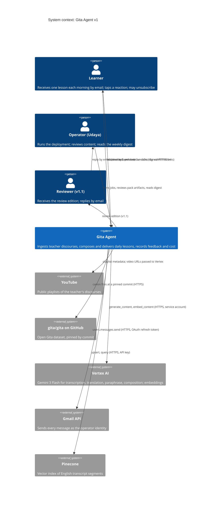
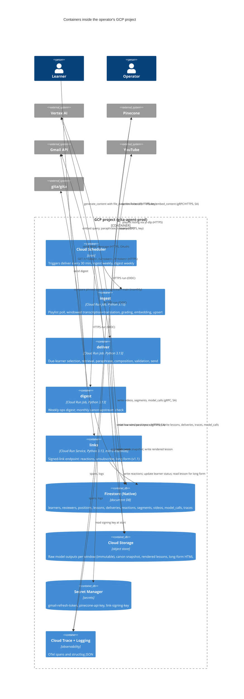
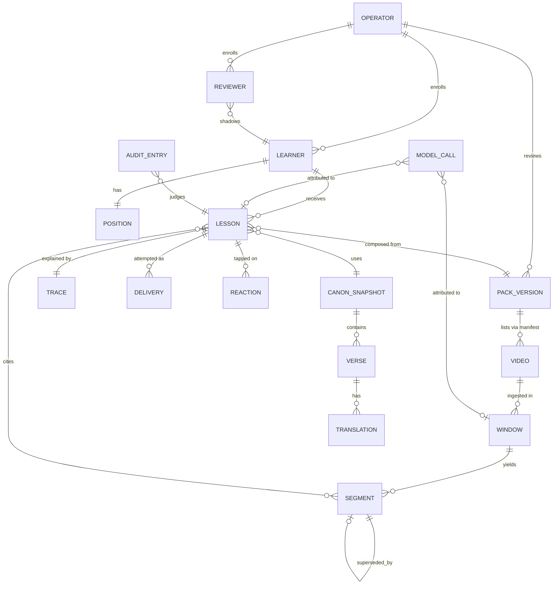

# Gita Agent — Technical Specification (v1)

| | |
|---|---|
| **Status** | Draft for review |
| **Owner** | Udaya Pillalamarri |
| **Answers to** | `docs/product_spec.md` (all P0/P1/P2 rows), `docs/content_spec.md` (all sections) |
| **Audience** | A senior or staff engineer who has to approve this, and the operator who has to run it |
| **Date** | 2026-09-13 |

---

## 1. Summary

Two scheduled batch jobs and one tiny web service on Google Cloud, all in
one Python package, no agent framework.

- **`ingest`** turns public YouTube discourses into stored, graded,
  searchable transcript segments in Telugu and English, using Gemini on
  Vertex AI directly from the video URL.
- **`deliver`** composes and emails one lesson per learner per day from the
  canon store and the transcript store, with a validation gate in front of
  every send.
- **`links`** is a small HTTPS endpoint that receives signed clicks:
  reactions, unsubscribe, and, in v1.1, the long-form page.
- **`digest`**, **`canon`**, **`pack`**, and **`explain`** are operator
  commands in the same package.

Everything runs on the operator's own GCP project. There are no API keys:
every Google service is called with the deployment's service account, and
the three secrets that exist (Gmail refresh token, Pinecone key, link
signing key) live in Secret Manager.

The design's center of gravity is the **fidelity contract** (product spec
§6.2). Every component either supplies a source verbatim, or produces
generated text under validation, or records what happened. Nothing else.

## 2. Constraints and non-goals, restated for engineering

| Constraint | Source | Engineering consequence |
|---|---|---|
| GCP only | Product §7.2 | Vertex AI, Cloud Run, Cloud Scheduler, Cloud Storage, Firestore, Secret Manager, Cloud Trace. No provider abstraction layer. |
| No ADK, no agent runtime in v1 | Product §5, §12.1 | Plain Python, one model call per composition, no tool loop. |
| Email only, two-way channel abstraction | Product §5, P2-3 | One `Channel` protocol with `send()` and `route_reply()`; one adapter (`GmailChannel`); inbound is a no-op that logs in v1. |
| Retrieval-only teacher content | P0-11 | Composition prompt receives only stored spans; a test removes the store and asserts canon-only output. |
| Every lesson carries provenance and a stable ID | P0-13, P0-14 | Lesson record is written before send with model, prompt, canon, pack, sequence versions and a random 128-bit ID. |
| Immutability | P0-15 | Lesson and delivery records are append-only; corrections create new pack versions. |
| Learner isolation and erasure by ID | P0-18, P2-9 | Every learner-scoped record carries `learner_id`; one deletion routine walks all of them. |
| Single operator, but records scoped for many | P2-6 | Every record carries `operator_id`. |
| Cost visible per call | P0-25 | A `model_calls` record per Gemini or embedding call with tokens and priced cost. |
| Tests first; evals separate from unit tests | Owner instruction; product §6.2 | Deterministic tests with fakes; a separate `eval` command pinned to model and prompt versions. |

## 3. System context



## 4. Containers and protocols



### 4.1 Every edge, with its protocol and auth

| From | To | Protocol | Auth | Notes |
|---|---|---|---|---|
| Cloud Scheduler | Cloud Run Jobs | HTTPS `run.jobs.run` | Scheduler's service account with `run.invoker`, OIDC | One schedule per job; `deliver` every 30 minutes, `ingest` weekly (Sunday 02:00 ET), `digest` weekly (Monday 07:30 ET) |
| ingest | YouTube | HTTPS via `yt-dlp` (`--flat-playlist -j`) | None (public) | Metadata only; no media download. yt-dlp is pinned; a JS runtime (deno) is installed in the image for its extractor |
| ingest, deliver | Vertex AI | `google-genai` SDK, `vertexai=True`, location `global`; gRPC with HTTPS fallback | Service account (ADC) | Model `gemini-3-flash-preview` for text tasks; `gemini-embedding-001` with `output_dimensionality=768` for vectors |
| ingest | Vertex AI, YouTube input | `Part(file_data=FileData(file_uri=<youtube url>, mime_type="video/*"), video_metadata=VideoMetadata(start_offset, end_offset))` | Service account | Verified in the 2026-09-12 probe: 5-minute window, 25 s, 27k input tokens |
| ingest, deliver, links, digest | Firestore | `google-cloud-firestore`, gRPC | Service account | Native mode, single database `(default)`, region `nam5` |
| ingest, deliver | Cloud Storage | `google-cloud-storage`, HTTPS | Service account | One bucket `gita-agent-prod-store`, uniform bucket-level access, no public objects |
| ingest, deliver | Pinecone | `pinecone` SDK, HTTPS | API key from Secret Manager | Serverless, index `gita-segments`, 768 dims, cosine, one namespace per `pack_id` |
| deliver, digest | Gmail API | `google-api-python-client`, `users.messages.send`, HTTPS | OAuth 2.0 refresh token for the operator's Google account, from Secret Manager | Scope `gmail.send` only. Sender is the operator identity (product §7.2) |
| learner | links | HTTPS GET | HMAC-signed token in the path; no cookies, no session | Cloud Run Service, `--min-instances 0`, `--allow-unauthenticated`, custom domain optional |
| digest | GitHub | HTTPS `api.github.com/repos/gita/gita/commits/main` | None (public, unauthenticated rate limit is ample) | Monthly canon upstream check (P0-24) |
| all jobs | Cloud Trace, Cloud Logging | OTel exporter, gRPC; structured stdout | Service account | Reused from v0 `observability.py` |

### 4.2 Why these services, briefly

Firestore rather than Cloud SQL: the operational data is small documents
with simple access paths, the service must idle at zero cost, and Firestore
has no instance to run. Cloud SQL's smallest instance costs more per month
than the whole rest of the system. Pinecone rather than Vertex Vector
Search: already provisioned, free at this scale, and the index is
rebuildable from Firestore so lock-in is nil. Gmail API rather than a
transactional email provider: the operator identity is a personal Google
account by decision (product §7.2), volumes are far below Gmail's limits,
and replies land in the operator's own inbox where reviewers' feedback is
meant to go. Full reasoning in §14.

## 5. Repository and package layout

```
gita-agent/
  gita/                      # one Python package, one CLI
    __main__.py              # python -m gita <command>
    cli.py                   # argparse: ingest, deliver, digest, canon, pack, explain, eval, links-serve
    config.py                # operator config + env; typed dataclass; validation
    observability.py         # OTel + structlog (carried from v0-legacy with tests)
    canon/                   # load, pin, diff, lookup
    packs/                   # manifest schema, artifact loaders, validators, review status
    ingest/                  # playlist poll, windows, transcribe, grade, embed, upsert, supersede
    retrieval/               # query build, candidate search, selection rules, trace
    compose/                 # paraphrase, compose, validate, render (email + review edition + long form)
    deliver/                 # due selection, idempotent delivery, channel protocol, gmail adapter
    links/                   # FastAPI app: /r /u /l, token sign/verify
    digest/                  # weekly aggregation, canon upstream check
    audit/                   # audit log read/write, golden set derivation
    store/                   # Firestore + GCS access, typed records, learner erasure
    pricing.py               # model price table, cost computation
  packs/chaganti-gita-telugu/  # manifest.yaml, sequence.json, chapter_openings.json, chapter_names.json,
                               # primer.md, banned_words.yaml, episodes.json (v1.1), prompts/*.txt
  audit/                     # JSONL audit log (content §8); golden/ derived
  tests/                     # unit (fakes), contract (live, gated), evals (gated)
  deploy/                    # gcloud scripts, Dockerfile, scheduler definitions, IAM
  docs/
```

One package, one Docker image, several entrypoints. The Cloud Run Jobs and
the `links` Service are the same image with different commands. This keeps
provenance simple: one image digest per deployment, recorded on every
lesson.

## 6. Data model

### 6.1 Entity relationships



### 6.2 Where each entity lives

| Entity | Store | Key | Why there |
|---|---|---|---|
| Canon snapshot (verses, translations, chapters, chapter names) | GCS `canon/<pin>/*.json`, loaded into memory by `deliver` at start | pin (commit hash) | Immutable per pin; 701 verses fit in memory; byte-identity is testable against the file |
| Pack version (manifest + artifacts) | Repository (`packs/`), copied into the image; hash recorded as `pack_version` | `pack_id`, `pack_version` | Reviewed content ships with code (content §3.3) |
| Video | Firestore `videos/{video_id}` | video_id | Ingestion status, supersession, expected-vs-actual for the poll |
| Window (raw model output) | GCS `raw/<pack_id>/<video_id>/<window_id>.json` | window_id | Immutable record of exactly what the model returned; never edited |
| Segment | Firestore `segments/{segment_id}`; vector in Pinecone `gita-segments` namespace `<pack_id>` | segment_id = `<video_id>:<start_s>` | Queryable store of record for retrieval; the vector is derived |
| Learner, Reviewer | Firestore `learners/{learner_id}`, `reviewers/{reviewer_id}` | random ID | Small, per-operator, must be erasable |
| Position | Firestore `positions/{learner_id}:{track}` | learner + track | Last verse delivered is the record (content §3.4) |
| Lesson | Firestore `lessons/{lesson_id}`; rendered HTML in GCS `lessons/<lesson_id>.html` | random 128-bit ID | Append-only; provenance; the ID is what links, replies, and audits key on |
| Trace | Firestore `traces/{lesson_id}` | lesson_id | One per lesson (content §4.6); kept separate so the lesson doc stays small |
| Delivery | Firestore `deliveries/{learner_id}:{track}:{local_date}` | learner + track + date | The idempotency key: exists once per learner per day per track |
| Reaction | Firestore `reactions/{lesson_id}:{learner_id}` | lesson + learner | Latest wins by overwrite; history kept in a subcollection |
| Model call | Firestore `model_calls/{call_id}` | random | Tokens and priced cost per call (P0-25) |
| Audit entry, golden set | Repository `audit/*.jsonl`, `audit/golden/` | lesson_id | Human judgments belong in version control (content §8) |

### 6.3 Record shapes

Field types are given as Python annotations; every record also carries
`operator_id`, `created_at`, and, where it can change, `updated_at`.

**Learner** `learners/{learner_id}`
```
learner_id: str            # random, 20 chars base32
email: str
name: str | None
timezone: str              # IANA, e.g. America/New_York
delivery_time: str         # "07:00"
pack_id: str
translation: str           # translator key, default from manifest
pace: Literal["daily"]     # schema allows "weekdays", "alternate" (P1-7)
story_track: bool          # v1.1, default False
status: Literal["active","unsubscribed"]
consent_at: datetime       # P2-4
token_key_version: int     # bumped on unsubscribe; invalidates all signed links (P0-4)
```

**Reviewer** `reviewers/{reviewer_id}` (v1.1)
```
reviewer_id, email, name, timezone, delivery_time, status, token_key_version
shadows_learner_id: str    # product §8.5: receives that learner's lesson as a review edition
```

**Position** `positions/{learner_id}:{track}`
```
pack_id, pack_version, sequence_version
last_verse: {chapter: int, verse: int} | None     # verse track
last_episode: str | None                          # story track (v1.1)
lesson_index: int          # derived, for "Day n"
day_count: int             # the learner's own count; never recomputed
last_success_local_date: date | None
```

**Segment** `segments/{segment_id}`
```
segment_id, pack_id, source_id, video_id, window_id
video_title: str
series_role: Literal["primary","secondary"]
start_s: float; end_s: float
te: str; en: str
confidence: Literal["high","medium","low"]
signals: {overlap_agreement_te: float|None, overlap_agreement_en: float|None,
          parse_ok: bool, script_ratio: float, length_ratio: float,
          degeneration: bool, model_self_report: str, model_reason: str}
refs: list[str]            # e.g. ["gita:2.47"]
superseded_by: str | None
model_id, prompt_version, embedding_model, ingested_at
```

**Lesson** `lessons/{lesson_id}`
```
lesson_id: str             # 128-bit random, base32, unguessable (P0-14)
learner_id, track: Literal["verse","story"]
local_date: date
position_snapshot: {lesson_index, day_count, chapter, first_verse, last_verse}
verse_ids: list[int]
translation_key: str
parts: {where_we_are: str, where_this_sits: str|None, verse: {sa, tl, en}|None,
        what_it_means: str, from_teacher: str|None, question: str}
citation: {video_id, video_title, series_id, start_s, source_url} | None
outcome: Literal["teacher_section","canon_only"]
reason_code: str | None
provenance: {model_id, compose_prompt_version, paraphrase_prompt_version,
             embedding_model, canon_pin, pack_id, pack_version,
             sequence_version, image_digest}
validation: {passed: bool, warnings: list[str], regenerations: int}
rendered_uri: str          # GCS path of the sent HTML
```

**Delivery** `deliveries/{learner_id}:{track}:{local_date}`
```
lesson_id: str | None
status: Literal["pending","sent","failed","blocked"]
attempts: list[{at: datetime, error: str|None, message_id: str|None}]
first_attempt_at, sent_at
```

**Model call** `model_calls/{call_id}`
```
purpose: Literal["transcribe","embed_doc","embed_query","paraphrase","compose","group","opening","episode"]
model_id, prompt_version
input_tokens: int; output_tokens: int; cached_tokens: int
cost_usd: Decimal          # from pricing table at call time; table version recorded
lesson_id | window_id | None
duration_ms, at
```

### 6.4 Erasure by learner ID (P2-9)

`gita learner erase <learner_id>` deletes, in one transaction group:
the learner document, both positions, all lessons and their traces and
rendered HTML, all deliveries, all reactions, and any reviewer shadow
pointer that references the learner. Model-call records keep their token
counts but drop the `lesson_id` (cost accounting survives, attribution does
not). The audit log in the repository is not touched by this command; it
is the operator's judgment record, and the command prints the lesson IDs
so the operator can redact by hand if a learner asks.

## 7. Ingestion

### 7.1 Sequence

```mermaid
sequenceDiagram
  autonumber
  participant S as Cloud Scheduler
  participant I as ingest job
  participant Y as YouTube (yt-dlp)
  participant F as Firestore
  participant V as Vertex AI (Gemini)
  participant G as GCS
  participant P as Pinecone
  S->>I: run (weekly, or operator: gita ingest --pack chaganti-gita-telugu)
  I->>I: load manifest; refuse if attestation missing; print rights warning
  loop each source in manifest order
    I->>Y: --flat-playlist -j <playlist_id>
    Y-->>I: video ids, titles, durations
    I->>F: upsert videos/{id} status=discovered; report grown/shrunk vs expected
  end
  loop each video not complete, in manifest order
    I->>I: plan windows: 600 s, 30 s overlap
    loop each window not present in GCS raw/
      I->>V: generate_content(file_data=youtube url, start/end offsets, transcribe_v1)
      V-->>I: {telugu[], english[], confidence, refs[]} + usage
      I->>G: write raw/<pack>/<video>/<window>.json (immutable)
      I->>F: write model_calls (tokens, cost)
    end
    I->>I: parse windows -> segments; overlap agreement; grade (min of signals)
    I->>I: dedupe overlap by nearer window centre
    I->>V: embed_content(en, RETRIEVAL_DOCUMENT, 768) in batches
    I->>P: upsert vectors (namespace=pack_id) with metadata
    I->>F: write segments/*; videos/{id} status=complete, grade distribution
  end
  I-->>S: exit 0 (or non-zero with the failing video and window)
```

### 7.2 Windowing and the transcription call

- Windows are `[k*570, k*570+600)` seconds, so each consecutive pair
  overlaps by 30 s (content §4.3). The last window ends at the video
  duration.
- The request is exactly the probe's shape: one `Part` with
  `file_data.file_uri` set to `https://www.youtube.com/watch?v=<id>`,
  `video_metadata.start_offset`/`end_offset` as `"<n>s"`, plus the text
  prompt `transcribe_v1.txt`. `response_mime_type="application/json"` with a
  response schema so parsing is deterministic.
- Timeouts: 300 s per call. Retries: 3 with exponential backoff on 429 and
  5xx; no retry on 4xx. A window that fails after retries is recorded as
  `failed` on the video and ingestion continues with the next video; the
  digest reports it. Re-running `ingest` picks up only missing windows
  (idempotent per window: the GCS object is the sentinel).
- The overlap region is transcribed twice by construction. Agreement is
  computed as normalized Levenshtein similarity on the Telugu text and on
  the English text of the overlapping seconds, using the `[mm:ss]` markers
  to align. The two values go into `signals` and drive the confidence floor
  and ceiling (content §4.4).
- Grading thresholds come from the manifest `settings.confidence` block.
  Until they are set (T4), ingestion runs and stores segments graded by the
  deterministic checks and the model self-report only, and marks the video
  `graded: provisional`.

### 7.3 Embedding and upsert

- Model `gemini-embedding-001` on Vertex, `task_type=RETRIEVAL_DOCUMENT`,
  `output_dimensionality=768`, batches of 100.
- Pinecone record: `id=segment_id`, vector, metadata `{pack_id, source_id,
  series_role, video_id, start_s, confidence, refs, superseded: bool}`.
  Metadata is what retrieval filters on; the text stays in Firestore.
- Re-ingestion of a window (content §4.6 fix path) writes new segments
  with a new `window_id` suffix, marks the old ones `superseded_by`, and
  updates the Pinecone metadata flag; superseded vectors are filtered out
  of every query rather than deleted, so a trace can still explain history.

### 7.4 Playlist poll (P0-23)

The weekly run is the same command. Discovery is cheap; the expensive work
only happens for videos whose `status != complete`. Playlist growth or
shrinkage versus `expected_videos` is written to the video collection and
surfaced by the digest.

## 8. Delivery

### 8.1 Sequence

```mermaid
sequenceDiagram
  autonumber
  participant S as Cloud Scheduler
  participant D as deliver job
  participant F as Firestore
  participant P as Pinecone
  participant V as Vertex AI
  participant G as GCS
  participant M as Gmail API
  S->>D: run (every 30 min)
  D->>F: query learners status=active
  D->>D: due = learners whose local now is within [delivery_time, +30min) and no delivery doc for today
  loop each due learner, each enabled track
    D->>F: create deliveries/{learner}:{track}:{date} status=pending (transaction; skip if exists)
    D->>F: read position; load pack; refuse if chapter unreviewed
    D->>D: next lesson = first sequence entry after last_verse
    D->>D: build query (translation + transliteration + word-meaning terms + chapter name)
    D->>V: embed_content(query, RETRIEVAL_QUERY)
    D->>P: query(namespace=pack, top_k=25, filter superseded=false)
    D->>F: fetch candidate segments; direct-ref candidates by refs index
    D->>D: select (direct ref > threshold > series margin); neighbors by position; trace
    alt span selected
      D->>V: paraphrase_v1(span) -> passage + segment ids
      D->>D: validate passage ids against span
    end
    D->>V: compose_v1(verse block, teacher block or none, banned list) -> what_it_means, question
    D->>D: validate (structure, byte-identity, banned hard tier, quotes, length, links)
    alt hard banned hit
      D->>V: compose again naming the words (max 2 retries)
    end
    alt validation passed
      D->>F: write lessons/{id}, traces/{id}, model_calls
      D->>G: write rendered HTML
      D->>M: users.messages.send (List-Unsubscribe header, signed links)
      D->>F: delivery status=sent; position advance (last_verse, day_count+1)
      opt reviewers shadowing this learner (v1.1)
        D->>M: send review edition (no reaction row) to each reviewer
      end
    else blocked
      D->>F: delivery status=blocked with reasons; position unchanged
      D->>M: operator failure notification (same day)
    end
  end
```

### 8.2 Due selection and idempotency (P0-1, P0-3)

- The job runs every 30 minutes. A learner is due when their local time,
  computed with `zoneinfo` from their IANA timezone, is in the half-hour
  window starting at their `delivery_time`, and no `deliveries` document
  exists for `(learner, track, local_date)`. Daylight-saving transitions
  are handled by `zoneinfo`; the local date is the learner's local date.
- The delivery document is created in a Firestore transaction with
  `create()` semantics before any model call. If it already exists, the
  learner is skipped. This is the single guarantee against double sends.
- A `failed` delivery (send error after the lesson was composed) is retried
  by the next run within the same hour: the run re-reads `pending`/`failed`
  documents with fewer than 3 attempts and resends the **same** stored
  lesson (never recomposed), so the retry is byte-identical to the first
  attempt. After the hour, a still-failed delivery triggers the operator
  notification, and the position does not advance, so tomorrow's run
  composes the same lesson again.
- A `blocked` delivery (validation failed after regeneration) notifies the
  operator immediately with the lesson ID and the validation report.

### 8.3 Composition and validation

Each step is a pure function over typed inputs, which is what makes it
testable with fakes:

| Step | Input | Output | Model call |
|---|---|---|---|
| `next_lesson(position, sequence)` | position, sequence | lesson entry | none |
| `build_query(entry, canon, translation)` | verse records | query text, key terms | none |
| `search(query, pack)` | query | candidates with scores | embed (1) + Pinecone |
| `select(candidates, settings, refs_index)` | candidates | winner, span, trace rows | none |
| `paraphrase(span)` | span (te+en) | passage, cited segment ids | Gemini (1) |
| `compose(verse_block, teacher_block, banned)` | blocks | what_it_means, question | Gemini (1, up to 3) |
| `validate(lesson, canon, store)` | lesson | report (hard failures, warnings) | none |
| `render(lesson, edition)` | lesson | HTML for `learner` / `review` / `longform` | none |

Validation implements content spec §5.4 row by row. Byte-identity is
checked by comparing the rendered verse fields to the canon snapshot
records, not by trusting the composition output. The banned-word check is a
compiled regex per tier built from `banned_words.yaml` at start, whole-word,
case-insensitive, with inflection suffixes.

### 8.4 Rendering and the email

- HTML email with a plain-text alternative. No images, no external CSS, no
  scripts, no tracking (P0-17). Inline CSS only.
- Headers: `From: <operator identity>`, `Reply-To: <operator identity>`,
  `List-Unsubscribe: <signed /u link>`, `List-Unsubscribe-Post:
  List-Unsubscribe=One-Click`, and `X-Gita-Lesson-Id: <lesson_id>` so v2
  threading can key on it (P2-1).
- Subject per content §7.9.
- The review edition (v1.1) is the same lesson rendered with
  `edition="review"`: banner, learner view, appendix from the trace and the
  segment records, the four questions, no reaction row.

### 8.5 The channel abstraction (P2-3)

```python
class Channel(Protocol):
    def send(self, message: OutboundMessage) -> SendResult: ...
    def route_reply(self, inbound: InboundMessage) -> ReplyRoute | None: ...
```

`OutboundMessage` is channel-neutral: recipient, message type (from the
P0-6 list), lesson_id, subject, body parts, links. `GmailChannel` renders
it to MIME and sends. `route_reply` exists in the protocol and in v1 the
Gmail adapter's implementation logs the inbound reference and returns
`None`; there is no inbound path in v1. An SMS adapter in v2 implements
both without touching the delivery job.

## 9. The links service

- FastAPI app, three routes: `GET /r/<token>` (reaction), `GET /u/<token>`
  (unsubscribe), `GET /l/<token>` (long form, v1.1). The reaction route
  renders the thank-you page with a `POST /r/<token>/note` for the optional
  sentence.
- **Token**: `base64url(payload) + "." + base64url(hmac_sha256(key, payload))`
  where payload is `{"p": purpose, "l": lesson_id, "u": learner_id, "v":
  token_key_version, "r": reaction|null}`. No email address or plaintext ID
  appears; the learner ID inside is random and only meaningful to the
  store. Verification checks the signature, then that `v` equals the
  learner's current `token_key_version`. Unsubscribe bumps the version, so
  every previously issued link for that learner stops working within one
  request (P0-4).
- No expiry on reaction or unsubscribe tokens: a learner may react to last
  week's lesson. Long-form tokens likewise, until unsubscribe.
- The service runs at `--min-instances 0` and `--max-instances 2`; cold
  starts of about a second are acceptable for a click. It has no
  dependency on Vertex or Pinecone.
- Every response sets `Cache-Control: no-store` and, on the long form,
  `X-Robots-Tag: noindex, nofollow`.
- Rate limiting: Cloud Armor is out of scope; the service is idempotent and
  a flood costs at most Cloud Run minutes.

## 10. Operator commands

All under `python -m gita`, all using the same config and store modules,
all emitting OTel spans. In the container, the same commands are the job
entrypoints.

| Command | What it does | Product/content refs |
|---|---|---|
| `ingest [--pack] [--video] [--window] [--force]` | Playlist poll and windowed ingestion; `--window` re-ingests one window and supersedes | P0-20, P0-21, P0-23; content §4.3–4.6 |
| `deliver [--now --learner <id>]` | The scheduled job; `--now` composes and sends immediately for one learner (P1-6 "resend") | P0-1..P0-3 |
| `digest [--week <date>]` | Builds and sends the weekly ops digest; monthly upstream check | P0-24 |
| `canon load --pin <sha>` / `canon diff --to <sha>` | Loads the snapshot to GCS; diffs verse records and lists affected lessons | P0-19; product §7.1 |
| `pack validate` / `pack sequence draft <chapter>` / `pack openings draft <chapter>` / `pack review <artifact> <chapter>` | Artifact tooling: validator, model-drafted proposals, mark reviewed with name and date | P0-27; content §3 |
| `pack tune confidence --video <id>` / `pack tune retrieval --verses <list>` | Prints the hand-check worksheets for T4 and T5 and writes chosen thresholds to the manifest | content §4.4, §4.5 |
| `explain <lesson_id>` | Prints the composition trace and validation report in readable form | content §4.6 |
| `learner add/list/erase` , `reviewer add/list` | Enrollment; erasure by ID | P0-22, P2-9, P1-1 |
| `eval [--golden audit/golden] [--model] [--prompt-version]` | Runs the fidelity evals; separate from unit tests (§12.3) | product §6.2, P2-2 |
| `links-serve` | Runs the FastAPI app (the Service entrypoint) | P0-4, P0-16, P0-17 |

Operator config is `config/operator.yaml` in the deployment (mounted as a
Secret Manager secret or baked into the image for a single-operator
deployment): `operator_id`, `operator_name`, `operator_email`,
`service_name`, `reaction_labels`, `budget_alert_usd`, `pricing_table_version`.

## 11. Observability and cost

- **Tracing**: `gita/observability.py` carried from `v0-legacy` with its
  tests: module-local provider, export gating by `OTEL_EXPORT_ENABLED` >
  `PYTEST_CURRENT_TEST` > default-on. Span tree per lesson:
  `deliver.learner` → `retrieval.search`, `retrieval.select`,
  `compose.paraphrase`, `compose.compose`, `compose.validate`,
  `channel.send`; per window: `ingest.window` → `vertex.transcribe`,
  `ingest.grade`, `vertex.embed`, `pinecone.upsert`. Every span carries
  `lesson_id` or `window_id`.
- **Logs**: structlog JSON to stdout, trace and span IDs injected, picked up
  by Cloud Logging. No transcript text, no learner email in logs.
- **Cost**: `pricing.py` holds a versioned table `{model_id: {input, output,
  cached} USD per 1M tokens}`. Every Vertex call is wrapped so that
  `usage_metadata` becomes a `model_calls` record with `cost_usd` computed
  at call time and the table version recorded. The digest sums by purpose
  and by week; the metric in product §10.1 ("reproducible from call
  records") is a test that re-sums the records and matches the digest.
- **Budget**: the $100 budget with 50/90/100% alerts already exists on the
  project (product open question 5, resolved).

## 12. Testing and evaluation

### 12.1 Principles

- **Test first.** Each module's tests are written before its
  implementation, per the owner's TDD instruction. A PR that adds behavior
  without tests is rejected by the review rules (§15).
- **Two kinds of test, never mixed.** *Deterministic tests* exercise code
  with fakes and never touch a network. *Model-dependent evals* call real
  models, are pinned to a model ID and prompt version, and are re-baselined
  on every model change (owner instruction; product §6.2 model
  independence). The first run in CI on every PR; the second run on demand
  and before any model or prompt change ships.
- **One real end-to-end run in phase 1.** The v0 lesson: 167 mocked tests
  hid a wrong endpoint. `tests/contract/` holds live tests against every
  external service, gated by `GITA_LIVE_TESTS=1`, and the task plan runs
  them against the real playlist before any other phase.

### 12.2 Deterministic tests, by module

| Module | What is tested | Fakes |
|---|---|---|
| `canon` | Loader keeps only English originals, strips the prefix with the documented regex, trims, is byte-stable across two loads of the same pin; chapter 13 mapping; diff lists changed verses and affected lessons | Local fixture copy of the four dataset files at the pin |
| `packs` | Manifest schema, attestation refusal, warning printed; sequence validator (rules 1, 2; count reported not failed; size-3 groups listed); per-chapter review status gating; artifact hash → `pack_version` | Fixture pack with two chapters |
| `ingest.windows` | Window boundaries and overlap for several durations; last window; window_id stability | none |
| `ingest.parse` | Parsing model JSON into segments; marker alignment; malformed output → parse failure grade | Recorded model outputs from the probe |
| `ingest.grade` | Each signal in isolation; minimum rule; provisional grading when thresholds unset; overlap similarity on constructed pairs | none |
| `ingest.supersede` | Re-ingesting a window marks old segments and flags vectors; idempotency by GCS sentinel | FakeGCS, FakeFirestore, FakePinecone |
| `retrieval` | Query construction; direct-ref precedence including chapter-13 off-by-one; threshold; primary-over-secondary margin; positional neighbors with time window and on-topic drop; every trace row and reason code; the **no-store test**: with an empty store, outcome is `canon_only` and no teacher text exists | FakePinecone returning scripted scores |
| `compose.paraphrase` | Returned segment IDs must lie within the span or validation fails | FakeGemini |
| `compose.compose` | Prompt assembly with and without teacher block; regeneration loop on hard banned hit, max 3 attempts; blocked path | FakeGemini scripted to emit banned words then clean text |
| `compose.validate` | Every row of content §5.4: structure, byte-identity against the snapshot, attribution, retrieval-only, trace present, quotation marks, hard/soft tiers, length hard/soft, provenance, links | none |
| `compose.render` | Learner, review, and long-form editions; section labels and marker; footer text; canon-only line; no external resources; headers | Golden HTML fixtures |
| `deliver.due` | Due window across timezones and DST transitions; already-delivered skip; pace variants schema | Frozen clock |
| `deliver.idempotency` | Transactional create; concurrent runs produce one delivery; retry resends the same stored lesson; failure after the hour notifies and does not advance | FakeFirestore with transaction semantics |
| `deliver.position` | Next lesson after last verse; regrouped sequence never skips or repeats; day count continues | Fixture sequences v1 and v2 |
| `channel.gmail` | MIME assembly, headers, subject formats, plain-text alternative; `route_reply` logs and returns None | FakeGmail |
| `links` | Token sign/verify; tampered token rejected; key-version bump invalidates; reaction latest-wins; note storage; unsubscribe idempotent and sends exactly one confirmation | FastAPI test client, FakeFirestore |
| `digest` | Aggregation matches records; cost re-sum equals digest figure; canon upstream check with a fake GitHub response; every P0-24 item present | Fixture week of records |
| `audit` | JSONL schema; golden set derivation is deterministic and excludes `rejected`/`logged` | Fixture log |
| `store.erase` | Erasure walks every learner-scoped collection; model_calls keep tokens, lose lesson_id | FakeFirestore, FakeGCS |
| `pricing` | Cost computation per model and table version; unknown model fails loudly | none |
| `observability` | Carried from v0 with its 23 tests | none |

Fakes live in `tests/fakes/` and implement the narrow interfaces the
`store`, `channel`, and model-client modules expose. There are no
`unittest.mock.patch` calls against SDK internals; the seams are ours.

### 12.3 Model-dependent evals

`gita eval` runs against `audit/golden/`, the derived golden set (content
§8), and against a small hand-built starter set until the golden set exists:

| Eval | What it measures | Pass criterion |
|---|---|---|
| Verse fidelity | Rendered verse fields vs canon | Byte-identical, 100% (this one is deterministic and also a unit test; it is here so the eval report is complete) |
| Attribution | Every teacher passage's cited segments exist and lie in the span | 100% |
| Paraphrase faithfulness | Model-as-judge (a second model, pinned) scores whether the paraphrase adds claims absent from the span | 0 additions on golden lessons marked confirmed |
| Meaning faithfulness | Judge scores "What it means" against verse + span | ≤1 flagged per 20 |
| Tone | Hard banned words = 0; soft count reported; judge flags directive advice or preaching | 0 hard; 0 directive |
| Retrieval quality | On the 20 tuning verses, the selected segment matches the hand-chosen one | ≥16 of 20 |
| Transcription stability | Overlap agreement distribution on a fixed video | Median above the manifest floor |

Each run records model IDs, prompt versions, judge model, and the golden
set hash, and writes a report under `audit/evals/<date>.json`. A model or
prompt change ships only with a report attached to its PR (P0-13).

### 12.4 Contract tests (live, gated)

One per external edge in §4.1: Vertex transcription on a 5-minute window of
the first video; Vertex embedding dimensionality; Pinecone upsert and
query round-trip in a test namespace; Gmail send to the operator's own
address; Firestore transaction semantics; GCS sentinel; yt-dlp playlist
listing; GitHub commit lookup. They run on demand and in a weekly CI job,
never on PRs.

### 12.5 CI

GitHub Actions on every PR: `ruff` (lint and format), `mypy --strict` on
`gita/`, `pytest tests/unit` with coverage reported, `pack validate` on
every pack in the repository, and a docs check that every `P0-` ID cited in
this document exists in the product spec. Greptile reviews the PR under the
rules in §15. Weekly: contract tests and `gita eval` against the current
golden set.

## 13. Deployment and operations

- **Image**: one Dockerfile (pattern carried from v0 `Dockerfile.ingestion`),
  Python 3.13 slim, `yt-dlp` and `deno` installed, non-root user. Built by
  Cloud Build on tag, pushed to Artifact Registry; the digest is injected as
  `GITA_IMAGE_DIGEST` and recorded on every lesson.
- **Jobs**: `gita-ingest`, `gita-deliver`, `gita-digest` as Cloud Run Jobs
  in `us-central1`, 1 task, 2 CPU / 2 GiB, timeout 3600 s (ingest) / 900 s
  (deliver, digest), max retries 0 (the jobs own their retry logic).
- **Service**: `gita-links`, min 0 / max 2 instances, 1 CPU / 512 MiB,
  concurrency 40.
- **Scheduler**: three schedules with OIDC to the jobs; `deliver` `*/30 *
  * * *`, `ingest` `0 2 * * 0` (ET), `digest` `30 7 * * 1` (ET).
- **IAM**: one service account `gita-runtime@` with `datastore.user`,
  `storage.objectAdmin` on the one bucket, `aiplatform.user`,
  `secretmanager.secretAccessor` on the three secrets, `cloudtrace.agent`,
  `logging.logWriter`. Nothing project-wide beyond Trace and Logging. The
  v0 `gita-ingest-worker@` Editor-role account is retired.
- **Secrets**: `gmail-refresh-token` (created once by a local OAuth flow
  the setup guide walks through), `pinecone-api-key`, `link-signing-key`
  (32 random bytes).
- **Config**: `config/operator.yaml` as a Secret Manager secret mounted at
  `/config`; pack files in the image.
- **Rollback**: redeploy the previous image digest; data is append-only so
  no schema rollback exists in v1.
- **Setup guide** (`docs/SETUP_GUIDE.md`, rewritten): GCP prerequisite
  first, APIs to enable (Vertex, Firestore, Run, Scheduler, Secret Manager,
  Artifact Registry, Cloud Build, Billing Budgets), the OAuth one-time flow,
  Pinecone index creation, budget alert, and the rights warning verbatim.

## 14. Decision log

| # | Decision | Alternatives considered | Why |
|---|---|---|---|
| D1 | Gemini on Vertex, directly from the YouTube URL, one call for transcript + translation | Chirp 3 then Gemini (v0); download + audio bytes to Gemini | Probe 2026-09-12: equal or better quality, one step, no media handling, roughly a tenth of Chirp's cost; Chirp 3 also exists only in the `us` multi-region and v0 pointed at `global` |
| D2 | Vertex with the service account; no API keys | AI Studio API key (v0) | Billing to the project, no secret to rotate, the key's prepaid credits were already exhausted when tested |
| D3 | Firestore for operational records | Cloud SQL Postgres; JSON on GCS with sentinels (v0) | Zero idle cost, transactional `create()` for idempotency, simple queries; SQL adds an always-on instance; GCS-only makes reactions and digests awkward |
| D4 | GCS for raw model outputs and rendered artifacts | Firestore only | Immutable record of exactly what the model said, cheap, and the vector index is rebuildable from it |
| D5 | Pinecone serverless, new index `gita-segments`, namespace per pack | Vertex Vector Search; pgvector | Already provisioned and free at this scale; rebuildable, so lock-in is nil; Vertex Vector Search has a minimum monthly cost |
| D6 | `gemini-embedding-001` at 768 dims | `text-embedding-005`; 3072 dims | Current Vertex embedding model; 768 keeps index size small and matches the existing index shape; quality difference at 10k documents is negligible |
| D7 | Gmail API with the operator's OAuth refresh token | SendGrid/Resend; Workspace domain delegation | Operator identity is a personal Google account by decision; volume is tiny; replies land where reviewers' feedback belongs; no third party sees learner addresses |
| D8 | `deliver` every 30 minutes with a transactional delivery document | One Scheduler job per learner; a long-running scheduler process | Handles any timezone with one schedule; the document is the idempotency guarantee; no process to keep alive |
| D9 | Retry resends the stored lesson, never recomposes | Recompose on retry | Immutability (P0-15) and byte-identical retries; recomposition could change a sent lesson's content |
| D10 | Signed HMAC links with per-learner key version | Random per-link tokens in the store; JWT with expiry | No store lookup per link issued; revocation by version bump is one write; no expiry needed for reactions |
| D11 | Reviewer shadows one named learner | Reviewer has own position; reviewer gets all learners' lessons | Zero extra composition; the review edition is a re-render of an existing lesson; trivially implementable (one field, one loop after send) |
| D12 | One package, one image, many entrypoints | Separate services per job | One provenance digest; shared store and validation code; no service-to-service calls |
| D13 | FastAPI for `links` only; no framework for jobs | Flask; bare `http.server` | Small, typed, testable with a test client; v2's agent service can share it |
| D14 | No Terraform in v1; `deploy/` shell scripts with gcloud | Terraform | One project, one operator, a dozen resources; scripts are readable by the setup guide's audience. Revisit when a second operator self-hosts |
| D15 | Reuse from `v0-legacy`: `observability.py` and its tests, the sentinel pattern, the CLI shape, the Dockerfile pattern | Rewrite all | Tested, fits, and the tracing conventions are already documented; everything else in v0 was tied to Drive/Chirp and is not carried |
| D16 | Chapter 13 keeps dataset numbering; resolver accepts both | Renumber the store | Byte-identity with the pinned source (content C7) |

## 15. Review rules (input to `.greptile/`)

Derived from the specs, to be written as the Greptile config in the same
PR as the clean slate:

1. No secrets in source; no API keys anywhere; every Google call via ADC.
2. Behavior change without a test in `tests/unit` is a finding.
3. Any code path that lets model output reach the verse fields, or that
   composes a teacher passage without a stored span, is a P0 finding (P0-9,
   P0-11).
4. Any change to `compose/validate.py` must keep every content §5.4 row
   covered by a test.
5. Any new external call needs timeout, bounded retry, and a span with
   `lesson_id` or `window_id`.
6. No `print`, no bare `logging`; structlog only; no transcript text or
   learner email in logs.
7. Delivery, lesson, and model-call records are append-only; a PR that
   updates a sent lesson's parts is a finding.
8. Every learner-scoped collection touched by a PR must be covered by
   `store.erase`.
9. Prompts and pack artifacts change only with a version bump and, for
   prompts, an eval report.
10. Markdown in `docs/` is reviewed for consistency with `product_spec.md`
    §6.2 and §9 (this replaces the v0 rule that ignored `*.md`).

## 16. Cost estimate

| Item | Basis | Monthly estimate |
|---|---|---|
| Ingestion, one-time | 85.5 h across four series at ~90 input tokens/s (URL path) plus ~10 output tokens/s | Low tens of dollars once; near zero after |
| Composition | 2 model calls per lesson, ~8k input / ~1k output tokens, 30–60 lessons/month in v1.0 | Under $1 |
| Embeddings | ~10k segments once; 1 query per lesson | Cents |
| Firestore, GCS | Tens of thousands of small documents; a few hundred MB | Free tier |
| Cloud Run Jobs | ~48 deliver runs/day at seconds each; weekly ingest/digest | Under $2 |
| Cloud Run Service | Idle at zero; clicks | Cents |
| Pinecone | Serverless free tier | $0 |
| Gmail API | Free | $0 |
| **Total, steady state v1.0** | | **Under $5, against a $100 budget alert** |

## 17. Path to v2 (design constraints honored)

- Every message carries `X-Gita-Lesson-Id`; `Channel.route_reply` exists;
  an inbound webhook for Gmail (Pub/Sub push) or Twilio becomes a new
  `links`-style service that resolves the lesson and hands the thread to
  the ADK agent (P2-1, P2-3).
- The agent's tools are the same `canon`, `retrieval`, and `store` modules
  exposed as functions; nothing in v1 is written in a way that requires
  the agent to bypass validation.
- The long-form data (content §6.3) is assembled by `compose.render` from
  the same records the agent will read (P2-5).
- `operator_id` on every record and the erasure routine make multi-operator
  and self-serve signup additive (P2-4, P2-6, P2-9).

## 18. Open questions

| # | Question | Who | Blocking? |
|---|---|---|---|
| E1 | Firestore region: `nam5` (multi-region, US) or `us-central1`? Recommendation: `nam5` for durability at no meaningful cost difference at this scale. | Udaya | Before phase 1 |
| E2 | Custom domain for `links` (e.g. `links.<your-domain>`) or the default `*.run.app` URL? The default works; a custom domain reads better in an email footer and is a v1.1 nicety. | Udaya | No |
| E3 | Gmail OAuth: a one-time browser consent on Udaya's machine produces the refresh token. Comfortable with that flow, or prefer a dedicated Google account as the operator identity? | Udaya | Before first send |
| E4 | Judge model for evals: a second Gemini model, or Claude via its API? Using a different model family as judge reduces shared blind spots but adds a second provider. Recommendation: Gemini Pro as judge in v1, revisit at gate 2. | Udaya | No |
