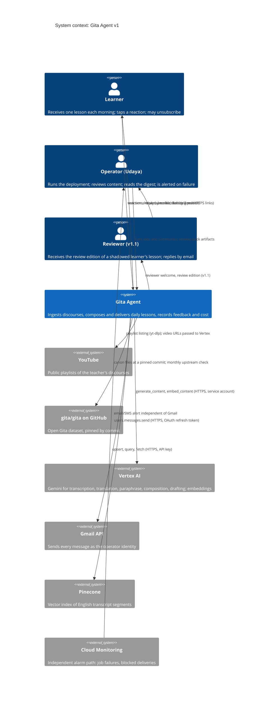
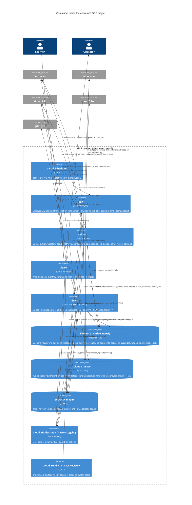
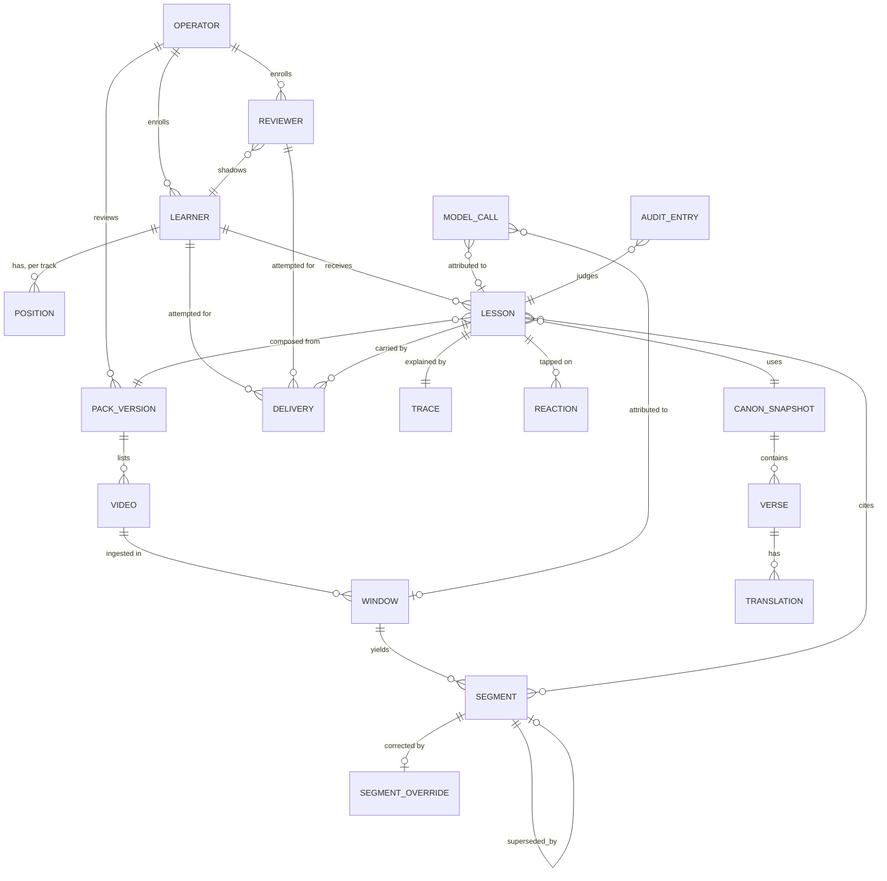

# Gita Agent — Technical Specification (v1)

| | |
|---|---|
| **Status** | Draft; revised after two independent staff-level review passes (81 findings, then 35 on the revision, 2026-09-13); awaiting Udaya's review |
| **Owner** | Udaya Pillalamarri |
| **Answers to** | `docs/product_spec.md` §9 (every P0; P1-1 to P1-7, P1-10, P1-11; P2-1 to P2-10 as design constraints), `docs/content_spec.md` (all sections) |
| **Audience** | A senior or staff engineer who has to approve this, and the operator who has to run it |
| **Date** | 2026-09-13 |

---

## 1. Summary

Three scheduled batch jobs and one small web service on Google Cloud, all
in one Python package, no agent framework.

- **`ingest`** turns public YouTube discourses into stored, graded,
  searchable transcript segments in Telugu and English, using Gemini on
  Vertex AI directly from the video URL, several windows in flight.
- **`deliver`** runs every five minutes, composes and emails one lesson per
  due learner from the canon store and the transcript store, with a
  validation gate in front of every send and a transactional delivery
  record as the only guarantee against double sends. It also sends welcome
  emails and review editions.
- **`digest`** sends the weekly ops digest and runs the monthly canon and
  model-deprecation checks.
- **`links`** is a small HTTPS service that receives signed clicks:
  reactions, unsubscribe (confirm page and one-click POST), and in v1.1 the
  long-form page. It sends the unsubscribe confirmation.
- Operator commands in the same package: `canon`, `pack`, `learner`,
  `reviewer`, `correction`, `audit`, `explain`, `render`, `eval`,
  `links-serve`.

Every Google Cloud service is called with a deployment service account,
and Gmail with the operator's own OAuth token; there are no Google API
keys. The one third-party key is Pinecone's. Four secrets exist in Secret
Manager: the Gmail refresh token, the Pinecone key, the link key, and the
operator config.

The design's center of gravity is the **fidelity contract** (product spec
§6.2). Every component either supplies a source verbatim, or produces
generated text under validation, or records what happened. Nothing else.

## 1.1 Key decisions, in brief

The full decision log with alternatives is §14. These three are the ones a
reader should know before the diagrams.

**Language: Python 3.13, for everything in v1 (D21, evidence in §14.1).**
The core of this system is prompt assembly, evaluation, similarity
scoring, and content tooling, where Python's ecosystem is far deeper than
Go's. yt-dlp is Python. The only v0 code that survives, the tracing
module, is Python. And the Agent Development Kit that v2 is built on is
Python-first by every measure taken on 2026-09-13: four times the
contributors, seven times the commit rate, 13.8 million monthly downloads,
and an evaluation package that the Go SDK does not have, which matters
because a golden-set eval harness is this project's gate to v2. Go was
seriously considered and is the candidate for rewriting the `links`
service in v2 if measured click latency warrants it.

**Compute: Cloud Run, Jobs for scheduled work and one Service for
clicks (D3, D8, D12).** Cloud Run runs a container only while there is
work: a Job runs to completion and exits; a Service scales to zero
instances when idle. There is no virtual machine to size, patch, or keep
alive, billing is per second of container time inside a monthly free
allowance, and the operator's only recurring "always on" component is a
managed cron entry in Cloud Scheduler. The alternatives, a long-running
scheduler process or a VM, were rejected because each needs something
kept alive and monitored, and each loses state on restart in ways the
delivery records would then have to paper over.

**Storage: three stores, one per shape of data (D3, D4, D5).**

| Store | Holds | Shape | Why this store |
|---|---|---|---|
| Cloud Storage, bucket `raw` | The raw model output for every ingestion window: exactly the JSON Gemini returned, Telugu and English together, one object per window, under an unlocked bucket retention policy. About 540 objects, ~30 MB for the default pack | Write-once blobs, never edited, read rarely | Immutable evidence of what the model said, enforced by the platform; the policy is unlocked so a wrongly ingested pack can still be taken down by the operator |
| Cloud Storage, bucket `store` | The canon snapshot per pin; every rendered lesson (HTML and text); long-form pages (v1.1) | Write-once blobs, read by link | Cheap, durable, no instance |
| Firestore | The parsed transcript **segments** (one document each: Telugu, English, timestamps, grade and signals, references; ~10,000 documents, ~20 MB), and every operational record: learners, positions, lessons, traces, deliveries, reactions, videos, packs, model calls | Small documents, key lookups, simple queries, transactions | The store of record for retrieval and rendering; transactional create for idempotency; zero idle cost |
| Pinecone | One vector per segment from its English text, with filter metadata | Derived index | Similarity search; rebuildable from Firestore in about an hour, so nothing depends on it surviving |

A transcription therefore exists twice on purpose, as immutable evidence
in Cloud Storage and as a queryable document in Firestore, plus a derived
vector in Pinecone. Nothing generated from the teacher's recordings is
ever in the repository (product §7.2).

**Why Firestore is the right operational store here.** Every daily
operation in this system is a point read or a small transaction: create
today's delivery record only if it does not already exist, fetch two
dozen segments by ID, write one reaction, advance one learner's position
together with the record of the send. Firestore does exactly those things
in single-digit milliseconds with ACID transactions, and its
create-if-absent is the single primitive that prevents a learner ever
receiving two lessons in a day. It costs nothing when idle and nothing at
this volume. It is a poor fit for analytics over large histories, which is
BigQuery's job (D22), and that is the one thing this system does not need
on the daily path.

**Why Firestore over BigQuery for these records.** BigQuery is a columnar
warehouse: it answers by scanning, so even a tiny table takes a second or
more per query, it has no transactional create, and row updates run as
quota-limited jobs. The delivery job would be slower and, on the
double-send guarantee, incorrect. BigQuery earns its place later, for
cross-month questions about cost, reactions, and eval trends, fed by
Firestore's managed export with no migration.

**Why not Cloud SQL.** Cloud SQL is a managed virtual machine running
Postgres. It runs whether or not anyone uses it, bills by the hour (about
ten dollars a month at the smallest size, more with high availability),
has a size chosen by hand, a maintenance window, and a connection limit
managed through a proxy, and it never scales to zero. Everything else in
this design costs nothing when idle and needs no capacity decision.
Adding it would put one always-on server back into a system that has
none, and it would be the most expensive component by an order of
magnitude. Google's serverless data services are Firestore and BigQuery;
Firestore fits the record shapes here, and BigQuery is where the
analytics go once there is history worth analyzing (D22).

**Architecture: serverless throughout (D3, D4, D5).** Every store and
service in the design shares the same properties: no instance, no
capacity planning, pay per operation, scale to zero. Firestore rather
than Cloud SQL was the decisive choice, for the reason above. What serverless
demands in return, and what this design is built around:

- *Stateless execution.* Any job can be killed at any second; the next
  run must recover from the store alone. Hence the delivery record, the
  raw-window sentinel, and the rule for a pending delivery with no lesson.
- *Idempotency.* "Did this already happen?" is answered by a transactional
  create in Firestore, never by process memory.
- *Cold starts.* Accepted and measured; the slim image and CPU boost for
  `links` exist for this reason.
- *Least privilege per component.* Three service accounts, each with only
  what its container needs, because there is no trusted host.
- *Observability without hosts.* Traces and structured logs are the only
  window into a run, so every span carries a lesson or window ID.
- *Event-driven where it earns its place.* Scheduler triggers and signed
  clicks in v1; Pub/Sub push for inbound email in v2, which is where
  event-driven design stops being optional.

## 2. Constraints, restated for engineering

| Constraint | Source | Engineering consequence |
|---|---|---|
| GCP only | Product §7.2 | Vertex AI, Cloud Run, Cloud Scheduler, Cloud Storage, Firestore, Secret Manager, Cloud Build, Cloud Monitoring, Cloud Trace. No provider abstraction. |
| No ADK, no agent runtime in v1 | Product §5, §12.1 | Plain Python; one model call per generated field; no tool loop. |
| Email only; two-way channel abstraction | Product §5, P2-3 | `Channel` protocol with `send()` and `route_reply()`; one adapter (`GmailChannel`); inbound logs and returns nothing in v1; a `text` rendering exists as a design case. |
| Retrieval-only teacher content | P0-11 | Composition receives only stored spans; the no-store test asserts canon-only output. |
| Provenance and a stable ID on every lesson | P0-13, P0-14 | Lesson record is written before send with model, prompt, canon, pack, sequence versions, image digest, and a random 128-bit ID. |
| Immutability | P0-15 | Lesson records never change after send; delivery records append attempts; the only sanctioned mutations are listed in §6.5. |
| Isolation and erasure by ID | P0-18, P2-9 | Every learner-scoped record carries `learner_id`; one chunked erasure routine walks all of them. |
| Single operator, records scoped for many | P2-6 | Every record carries `operator_id`. |
| Cost visible per call | P0-25 | A `model_calls` record is written at call time, priced from a versioned table. |
| Tests first; evals separate | Owner instruction; product §6.2 | Deterministic tests with fakes on every PR; `gita eval` pinned to model and prompt versions, run on demand. |

## 3. System context



## 4. Containers and every edge

A note on the word *container*. The diagram below is a C4 container
diagram, and in the C4 model a "container" is any separately deployable
or runnable unit, including databases and buckets; the term predates
Docker and is unrelated to it. Separately, Cloud Run runs OCI (Docker)
container images, and every job and service in this design is deployed as
one. So `ingest`, `deliver`, `digest`, and `links` are containers in both
senses; Firestore, Cloud Storage, Secret Manager, and Scheduler are C4
containers only.



### 4.1 Every edge, with its protocol and auth

| From | To | Protocol | Auth | Notes |
|---|---|---|---|---|
| Cloud Scheduler | Cloud Run Jobs | HTTPS `POST …/jobs/<job>:run` on the Cloud Run Admin API | Scheduler service account with `roles/run.invoker` on each job, **OAuth access token** (`cloud-platform` scope). OIDC ID tokens are for Cloud Run Services, not for the Admin API | `deliver` `*/5 * * * *`; `ingest` Sunday 02:00 ET; `digest` Monday 07:30 ET |
| ingest | YouTube | HTTPS via pinned `yt-dlp` with a `deno` runtime, `--flat-playlist -j` | None | Metadata only. Datacenter IPs are sometimes bot-challenged; see §7.4 for the fallback |
| ingest, deliver, digest | Vertex AI | `google-genai` SDK, `vertexai=True`, HTTPS (REST) | Service account (ADC) | Text model `gemini-3-flash-preview` with GA fallback named in §14 D17; embeddings `gemini-embedding-001` at 768 dims. Location `global` for Gemini; the embedding endpoint location is verified by contract test (§12.4) |
| ingest | Vertex AI (YouTube input) | `Part(file_data=FileData(file_uri=<url>, mime_type="video/*"), video_metadata=VideoMetadata(start_offset, end_offset))` | Service account | Verified 2026-09-12 on window 0 of one video. Timestamp origin for clipped windows and any per-project YouTube-hours quota are verified by contract test before the full run (§7.2) |
| ingest, deliver, links, digest | Firestore | `google-cloud-firestore`, gRPC | Service account | Native mode, `(default)` database, `nam5` assumed (open question E1, §18) |
| ingest, deliver, links | Cloud Storage | `google-cloud-storage`, HTTPS | Service account | Two buckets, uniform access, no public objects: `gita-agent-prod-raw` under an unlocked bucket retention policy (retention is bucket-level in GCS), and `gita-agent-prod-store` without one so erasure can delete rendered lessons (§13) |
| ingest, deliver | Pinecone | `pinecone` SDK, HTTPS | API key from Secret Manager | Serverless; new index `gita-segments`, 768 dims, cosine; one namespace per `pack_id` |
| deliver, digest, links | Gmail API | `google-api-python-client`, `users.messages.send`, and `users.messages.get(format=metadata)` on messages we sent | OAuth 2.0 refresh token for the operator's Google account, from Secret Manager; scopes `gmail.send` and `gmail.metadata` (headers only, to read back the Message-ID Gmail actually stamped) | The OAuth consent screen must be **In production** (unverified is fine under 100 users); in Testing status Google revokes refresh tokens after 7 days. Tokens are also revoked when the account password changes or when the per-client token cap is exceeded; the `delivery.failed` alarm and the re-consent runbook step in §13 cover that (§13) |
| learner | links | HTTPS | Encrypted, authenticated token in the path; no cookies | Cloud Run Service, `--min-instances 0`, unauthenticated |
| all jobs, links | Secret Manager | Secrets injected as environment variables, resolved when an instance or job task starts | Service account `secretAccessor` on the named secrets only | Versions are pinned explicitly, not `latest`; `link-key` current and previous versions are both injected so rotation has a grace period (§9) |
| digest | GitHub | HTTPS `api.github.com/repos/gita/gita/commits/main` | None | Monthly canon upstream check (P0-24) |
| digest | Vertex AI | `models.list` | Service account | Monthly check that the pinned model IDs still resolve; retirement dates are not exposed by the API, so the digest also prints a reminder to check the Vertex deprecations page |
| all | Cloud Trace, Logging, Monitoring | OTel exporter (gRPC); structured stdout; log-based metrics | Service account | Alerting policies in §11 |
| Cloud Build | Artifact Registry, Cloud Run | Build on tag; weekly scheduled triggers for contract tests and evals | Cloud Build service account | Contract tests run inside GCP so no secret leaves the project (§12.5) |

### 4.2 Why these services

Firestore rather than Cloud SQL: small documents, simple access paths,
zero idle cost, and a transactional `create()` that gives idempotency in
one line; the smallest Cloud SQL instance costs more per month than the
rest of the system. Pinecone rather than Vertex Vector Search: the account
exists, the serverless tier is free at this scale, the index is rebuildable
from Firestore so lock-in is nil, and Vertex Vector Search has a minimum
monthly charge. Gmail API rather than a transactional provider: the
operator identity is a personal Google account by decision (product §7.2),
volumes are tiny, replies land in the operator's own inbox where reviewer
feedback belongs, and no third party sees learner addresses. Cloud
Monitoring for alarms because an alarm must not share the dependency that
failed. Full reasoning in §14.

## 5. Repository and package layout

```
gita-agent/
  gita/                      # one Python package, one CLI
    __main__.py, cli.py      # python -m gita <command>
    config.py                # operator config (from the operator-config secret) + env; typed; validated
    observability.py         # OTel + structlog, carried from v0-legacy with its tests
    canon/                   # load, pin, diff, lookup, overrides, chapter-13 mapping
    packs/                   # manifest schema, artifacts, validators, review status, texts
    ingest/                  # discover, windows, transcribe, parse, grade, regrade, embed, upsert, supersede
    retrieval/               # query build, search, select, neighbors, trace
    compose/                 # paraphrase, compose, validate, render (learner, review, longform, text)
    deliver/                 # due selection, welcome, idempotent delivery, review editions, channel protocol, gmail adapter, notifications
    links/                   # FastAPI app: /r, /u, /l; token encrypt/verify; scanner filtering
    digest/                  # weekly aggregation; canon and model checks
    audit/                   # audit log add/read; golden set derivation with input snapshots
    store/                   # Firestore + GCS access, typed records, indexes, erasure
    pricing.py               # versioned model price table; cost computation
  packs/chaganti-gita-telugu/
    manifest.yaml            # sources, videos (discovered list), settings, prompts, artifacts
    sequence.json  chapter_openings.json  chapter_names.json  canon_overrides.json
    primer.md  texts.yaml  banned_words.yaml  episodes.json (v1.1)
    prompts/transcribe_v1.txt paraphrase_v1.txt compose_v1.txt group_v1.txt opening_v1.txt episode_v1.txt
  audit/                     # JSONL audit log; golden/ (derived, with snapshotted inputs); evals/ (reports)
  tests/unit  tests/fakes  tests/contract  tests/evals
  deploy/                    # Dockerfile (jobs), Dockerfile.links (slim), gcloud scripts, scheduler, IAM, firestore.indexes.json, cloudbuild.yaml
  docs/
```

One package, two images (a full one for jobs, a slim one for `links`),
several entrypoints. Each image digest is recorded on every lesson it
produces.

## 6. Data model

### 6.1 Entity relationships



### 6.2 Where each entity lives

| Entity | Store | Key | Why there |
|---|---|---|---|
| Canon snapshot (verses, translations, chapters) | GCS `canon/<pin>/*.json`; loaded into memory at job start | commit pin | Immutable per pin; 701 verses fit in memory; byte-identity is testable against the file. Chapter names (IAST) are a pack artifact, not canon |
| Pack version | Repository `packs/`, copied into the image | `manifest.version` (human-bumped) plus `pack_digest` (hash of the pack directory); both recorded on every lesson | Reviewed content ships with code (content §3.3) |
| Pack state | Firestore `packs/{pack_id}` | pack_id | Mutable per-pack runtime state: length-ratio running median, tuning dates, `discovery_blocked` |
| Video | Firestore `videos/{pack_id}:{video_id}` | pack + video | Discovery status, completion, grade distribution, expected-vs-actual |
| Window (raw model output) | GCS bucket `gita-agent-prod-raw`, `<pack_id>/<video_id>/<window_id>.g<gen>.json` | window + generation | Immutable record of what the model returned; the object's existence is the ingestion sentinel |
| Segment | Firestore `segments/{segment_id}`; vector in Pinecone namespace `<pack_id>` | `segment_id = <video_id>:<window_id>:g<gen>:<start_s>` | Re-ingestion is a new generation, so old segments survive as superseded |
| Segment override | Firestore `segment_overrides/{segment_id}` | segment_id | Corrected English from a verified audit entry (content §9); precedence in §8.3 |
| Learner, Reviewer | Firestore `learners/{learner_id}`, `reviewers/{reviewer_id}` | random ID | Erasable; every learner-scoped record carries the ID |
| Position | Firestore `positions/{learner_id}:{track}` | learner + track | Last verse delivered is the record (content §3.4) |
| Lesson | Firestore `lessons/{lesson_id}`; rendered HTML in GCS `lessons/<lesson_id>/<edition>.html` | random 128-bit ID | Immutable after send; provenance; what links, replies, and audits key on |
| Trace | Firestore `traces/{lesson_id}` | lesson_id | Content §4.6 record; kept separate so the lesson document stays small |
| Delivery | Firestore `deliveries/{audience}:{recipient_id}:{kind}:{window_date}` | audience + recipient + kind + window date, where kind is `verse`, `story`, `welcome:<attempt_n>`, `review:verse`, `review:story`, `correction:<lesson_id>`, or `resend:<lesson_id>:<n>`; the date segment is the window date W for lesson and correction kinds and the creation date for welcome kinds | The idempotency key; reviewers, corrections, and resends get their own so nothing collides with the day's lesson and every send is retried and reported |
| Reaction | Firestore `reactions/{lesson_id}:{learner_id}` with `history/` subcollection | lesson + learner | Latest wins by overwrite; history kept; the optional note lives on the same document |
| Model call | Firestore `model_calls/{call_id}` | random | Written at call time (P0-25) |
| Audit entry, golden set, eval reports | Repository `audit/` | lesson_id | Human judgments belong in version control (content §8) |

### 6.3 Record shapes

Every record also carries `operator_id`, `created_at`, and where it can
change, `updated_at`.

**Learner** `learners/{learner_id}`
```
learner_id: str                # random, 20 chars base32
email, name: str | None
timezone: str                  # IANA
delivery_time: str             # "HH:MM", any minute
pack_id, translation: str
pace: Literal["daily","weekdays","alternate"]   # only "daily" implemented in v1.0 (P1-7)
story_track: bool              # v1.1
story_track_enabled_date: date | None   # v1.1; the date of the next delivery_time after the enable instant (same rule as first_lesson_date); `learner update --story-track on` sets it and creates positions/{id}:story
status: Literal["welcome_pending","active","unsubscribed"]
consent_at: datetime           # P2-4
welcome_sent_at: datetime | None
first_lesson_date: date | None # set when the welcome is sent: next delivery_time after it
link_key_version: int          # bumped on unsubscribe; invalidates every issued link (P0-4)
```

**Reviewer** `reviewers/{reviewer_id}` (v1.1)
```
reviewer_id, email, name, status, welcome_sent_at, link_key_version
shadows_learner_id: str        # receives that learner's lesson as a review edition, at that learner's time
```

**Position** `positions/{learner_id}:{track}`
```
pack_id, pack_version, pack_digest, sequence_version
first_date: date               # the track's first window date: first_lesson_date, or story_track_enabled_date
last_verse: {chapter, verse} | None       # verse track
last_episode_end: {video_number: int, end_s: float} | None   # story track (v1.1): the end instant of the last delivered episode
lesson_index: int; day_count: int         # day_count is the learner's own count, never recomputed
last_success_window_date: date | None     # the window date W of the last successful send, never the calendar date of the send
```

**Segment** `segments/{segment_id}`
```
segment_id, pack_id, source_id, video_id, window_id, generation: int
video_title, series_role: Literal["primary","secondary"]     # source_id names the series
start_s, end_s: float
te, en: str
confidence: Literal["high","medium","low"]; graded: Literal["provisional","final"]
signals: {overlap_agreement_te, overlap_agreement_en: float|None, parse_ok: bool,
          script_ratio, length_ratio: float, degeneration: bool,
          model_self_report: str, model_reason: str}
refs: list[str]; refs_alt: list[str]      # refs_alt carries the chapter-13 alternate numbering
superseded_by: str | None
model_id, prompt_version, embedding_model, ingested_at
```

**Lesson** `lessons/{lesson_id}`
```
lesson_id: str                  # 128-bit random, base32 (P0-14)
learner_id, track: Literal["verse","story"]
window_date: date               # the delivery window date W (§8.2), never the calendar date of the send; drives the subject line, digest, and correction note
position_snapshot: {lesson_index, day_count, chapter, first_verse, last_verse}
verses: list[{chapter, verse, canon_verse_id: int, sa, tl, en, translator}]
parts: {where_we_are, where_this_sits: str|None, what_it_means, from_teacher: str|None, question}
citation: {source_id, source_title, video_id, video_title, start_s, end_s, source_url} | None
outcome: Literal["teacher_section","canon_only","blocked"]; reason_code: str | None
provenance: {model_id, compose_prompt_version, paraphrase_prompt_version, embedding_model,
             canon_pin, pack_id, pack_version, pack_digest, sequence_version, image_digest}
validation: {passed: bool, warnings: list[str], regenerations: int}
rendered: {learner_html, learner_text: gcs_uri, review: gcs_uri|None, longform: gcs_uri|None}
message_id: str                 # deterministic RFC 5322 Message-ID derived from lesson_id; whether Gmail preserves it is a contract-test result, not an assumption
```

**Trace** `traces/{lesson_id}` (content §4.6, verbatim)
```
query: {text, key_terms: list[str], verses: list[str]}
settings: {relevance_threshold, primary_over_secondary_margin, neighbor_before_seconds,
           neighbor_after_seconds, neighbor_similarity_floor, manifest_version}   # same key names as the manifest
candidates: list[{segment_id, video_id, video_title, start_s, series_role, similarity: float,
                  confidence, signals, direct_ref: bool,
                  rule: Literal["direct_ref","above_threshold","below_threshold","low_confidence",
                                "secondary_lost_margin","neighbor_off_topic","neighbor_low_confidence"]}]
selection: {winner_segment_id, span_segment_ids: list[str], paraphrase_cited_ids: list[str]} | None
outcome: Literal["teacher_section","canon_only","blocked"]
reason_code: Literal["no_candidates","all_below_threshold","all_low_confidence",
                     "paraphrase_failed_validation","hard_banned_after_regeneration",
                     "chapter_unreviewed"] | None   # a cancelled delivery writes no trace
attempts: list[{n: int, what_it_means, question, hard_hits: list[str], soft_hits: list[str]}]
provenance: {embedding_model, paraphrase_model, paraphrase_prompt_version, compose_model, compose_prompt_version}
```

**Delivery** `deliveries/{audience}:{recipient_id}:{kind}:{window_date}`
```
audience: Literal["learner","reviewer"]; recipient_id; kind
message_type: MessageType       # one enum, exactly the P0-6 list: welcome, lesson, story_lesson, correction,
                                # unsubscribe_confirmation, reviewer_welcome, review_edition, failure_notification, ops_digest
window_date: date               # the local date the delivery window belongs to (§8.2); part of the key
lesson_id: str | None; message_id: str | None      # message_id as we set it
sent_message_id: str | None     # as Gmail stamped it, read back with gmail.metadata; the thread reference for v2
status: Literal["pending","sending","sent","failed","failed_final","blocked","cancelled","uncertain"]
                                # pending and failed are retryable inside the window; sending times out to uncertain;
                                # cancelled = recipient unsubscribed before the send (not a failure, not alarmed);
                                # sent, failed_final, blocked, cancelled, uncertain are terminal
window_opens_at, window_closes_at: datetime   # lesson and correction kinds: the recipient's window for W (W+delivery_time, +2h); welcome kind: created_at, +2h
expected_recipient_status: Literal["welcome_pending","active"]   # the precondition every → sending claim checks: welcome_pending for welcome kinds, active for everything else
recompose_count: int            # a pending document with no lesson is recomposed at most once
rendered: {html: gcs_uri, text: gcs_uri} | None   # what was or will be sent; for lesson kinds the lesson's rendering, for welcome and correction kinds a deterministic render from texts.yaml and primer.md written at claim time, so a retry resends the same bytes
attempts: list[{at, error: str|None, gmail_api_id: str|None}]
first_attempt_at, sending_since, sent_at, operator_notified_at: datetime | None
block_reasons: list[str]
```

**Reaction** `reactions/{lesson_id}:{learner_id}`
```
reaction: Literal["got_it","unclear","loved_it"]   # keys; labels come from operator config
note: str | None                # the optional one sentence
at: datetime; history/ subcollection of {reaction, note, at}
```

**Video** `videos/{pack_id}:{video_id}`
```
source_id, title, duration_s, discovered_at
status: Literal["discovered","in_progress","complete","failed"]   # never downgraded by discovery
failed_windows: list[str]; graded: Literal["provisional","final"]
grade_distribution: {high: int, medium: int, low: int}
```

**Pack state** `packs/{pack_id}`
```
length_ratio_median: float | None; discovery_blocked_at: datetime | None
```   # tuning dates live in the manifest settings, not here

**Model call** `model_calls/{call_id}`
```
purpose: Literal["transcribe","embed_doc","embed_query","paraphrase","compose","group","opening","episode","judge"]
model_id, prompt_version
input_tokens, output_tokens, cached_tokens: int
cost_usd: Decimal; pricing_table_version: str
lesson_id | window_id | None; duration_ms; at
```

**Segment override** `segment_overrides/{segment_id}`
```
en: str; audit_ref: str; pack_version: int; created_at
```

### 6.4 Chapter 13 mapping (content §2.3)

The dataset numbers chapter 13 as 1–35; standard 700-verse editions number
the same verses 0–34. Mapping: dataset `13.n` ↔ standard `13.(n−1)` for
n in 1..35. The canon store keeps dataset numbering. `ingest.parse` writes
`refs` as detected and, for any `gita:13.n`, also `refs_alt: gita:13.(n+1)`
so a direct-reference lookup for dataset verse `13.k` matches either
`refs` containing `13.k` or `refs_alt` containing `13.k`.

### 6.5 Mutability rules

- **Lesson**: written once before send; never updated. Corrections create
  new pack versions.
- **Delivery**: every status transition is a Firestore transaction with a
  precondition on the current status (compare-and-set), so two overlapping
  runs cannot both claim a document. Allowed transitions: `pending →
  sending`; `sending → sent | failed | uncertain`; `failed → sending`
  (retry, inside the window only; rewrites `sending_since`); `pending |
  failed → failed_final` (window expired); `pending → blocked`; `pending |
  failed → cancelled` (recipient no longer in the status the kind expects:
  `welcome_pending` for welcome kinds, `active` for all others);
  `uncertain → sent` only by the run that holds the Gmail API id for that
  send (it has proof the message was accepted) **and** only if the
  position has not already been advanced past `W` by the operator
  (`last_success_window_date < W`, or for a welcome `learner.status ==
  welcome_pending`); otherwise the run records its API id on the document
  and leaves it `uncertain`. `sending` whose `sending_since` is older than
  the **send timeout of 180 seconds** (Gmail client timeout 60 s, metadata
  read, and the transaction, with margin) becomes `uncertain`. Terminal
  states are `sent`, `failed_final`, `blocked`, `cancelled`, `uncertain`.
  `attempts` is append-only. The Lesson and Trace for a delivery are
  written **inside** the `pending → sending` transaction, so a run that
  loses the claim writes nothing.
- **Segment**: writes after creation are `superseded_by`, and the grade
  fields (`confidence`, `signals`, `graded`) by `ingest --regrade` only.
- **Position, Learner, Reviewer, Video**: mutable state, by design.
- **Model call**: never updated, except by erasure (below).
- **Erasure** (P2-9, `gita learner erase`): deletes the learner document,
  positions, lessons, traces, rendered objects (listed by the
  `lessons/<learner_id>/` prefix, so orphans are covered), deliveries,
  reactions and
  their history subcollections, and any reviewer shadow pointer, in
  batches of at most 400 writes; it is **not atomic** and is safe to
  re-run. It runs as the operator's own credentials, which hold delete
  rights on the store bucket that the job service account does not (§13).
  Model-call records keep their token counts and lose `lesson_id`.
  The repository audit log is not touched; the command prints the affected
  lesson IDs for manual redaction.

## 7. Ingestion

### 7.1 Sequence

```mermaid
sequenceDiagram
  autonumber
  participant S as Scheduler / operator
  participant I as ingest job
  participant Y as YouTube (yt-dlp)
  participant F as Firestore
  participant V as Vertex AI
  participant G as GCS
  participant P as Pinecone
  S->>I: run (weekly; or gita ingest [--video] [--window] [--regrade])
  I->>I: load manifest; refuse without attestation; print rights warning
  loop each source
    I->>Y: --flat-playlist -j <playlist_id>
    alt listing succeeds
      Y-->>I: video ids, titles, durations
      I->>F: videos: create-if-absent status=discovered; never downgrade; note grown/shrunk
    else bot-challenged or error
      I->>I: use manifest videos[] list; mark discovery_blocked for the digest
    end
  end
  loop each video not complete, manifest order
    I->>I: plan windows [k*570, k*570+600)
    par up to 8 windows in flight
      I->>V: generate_content(url, offsets, transcribe_v1, JSON schema)
      V-->>I: {telugu[], english[], confidence, reason, refs[]} + usage
      I->>F: model_calls (at call time)
      I->>G: raw/<pack>/<video>/<window>.g<gen>.json (create-if-absent)
    end
    I->>I: parse -> segments; timestamps normalized to video start; overlap agreement; grade; dedupe
    I->>V: embed_content(en, RETRIEVAL_DOCUMENT, 768) in verified batch size
    I->>P: upsert (namespace=pack_id) with metadata
    I->>F: segments/*; videos status=complete, grade distribution, graded provisional|final
  end
  I-->>S: exit 0, or non-zero naming the failing video and window
```

### 7.2 Windowing, concurrency, and the transcription call

- Windows are `[k*(W−O), k*(W−O)+W)` seconds with `W = settings.window_seconds`
  (600) and `O = settings.overlap_seconds` (30) from the manifest (content
  §4.3, §4.1); the numbers below assume the defaults.
- The request is the probe's shape, with `response_mime_type=
  "application/json"` and a response schema so parsing is deterministic.
- **Concurrency**: up to 8 windows in flight per job via `asyncio`, bounded
  by a semaphore; per-call timeout 300 s; 3 retries with exponential
  backoff on 429 and 5xx, none on other 4xx. The probe measured ~25 s per
  5-minute window, so ~50 s per window; 85.5 h is ~540 windows, roughly
  one hour at 8 in flight. The job's task timeout is 6 hours and
  `--tasks` can shard by video (`--task-index` selects videos `i mod N`)
  if a run ever needs it.
- **Idempotency per window**: the raw object's existence is the sentinel;
  a re-run transcribes only missing windows. `--force` or `--regrade` are
  explicit.
- **Timestamp origin**: the model is asked for `[mm:ss]` relative to the
  clip; `ingest.parse` adds `k*570`. Whether the model already reports
  full-video offsets for a clipped request is verified by the contract
  test on window k=1 before the full run, and the parser normalizes either
  way.
- **YouTube-hours quota**: the per-project limit for YouTube input on
  Vertex is not documented in this spec; the contract test ingests one
  full video and records the observed behavior in §7.5 before the full
  run is scheduled.
- **Grading** implements content §4.4: overlap agreement (normalized
  Levenshtein on the aligned overlap, Telugu and English), parse
  integrity, script ratio, length ratio against the pack's running median
  (persisted on `packs/{pack_id}`), degeneration, and the model
  self-report; grade is the minimum. Thresholds and bands come from the
  manifest `settings.confidence` block (content §4.1). Until set, segments
  are `graded: provisional`; `gita ingest --regrade --video <id>`
  recomputes grades from `raw/` without re-transcribing and updates
  Firestore and Pinecone metadata.

### 7.3 Embedding, upsert, supersession

- `gemini-embedding-001`, `task_type=RETRIEVAL_DOCUMENT`,
  `output_dimensionality=768`; batch size and endpoint location are
  verified by the contract test and recorded in the manifest settings.
- Pinecone record: `id=segment_id`, vector, metadata `{pack_id, source_id,
  series_role, video_id, start_s, confidence, superseded: bool}`. Neither
  `refs` nor the English text is in Pinecone (a deliberate narrowing of
  content §4.4: text lives in Firestore only); direct-reference lookup is a
  Firestore query (§8.3).
- Re-ingestion writes generation `g+1` segments, marks generation `g`
  `superseded_by`, and sets `superseded: true` on their vectors; queries
  filter `superseded == false`. Nothing is deleted, so traces can explain
  history.

### 7.4 Discovery and the weekly poll (P0-23)

The manifest carries a top-level `videos:` list (entries with `source_id`,
video ID, title, duration) written by `gita pack discover`, which runs `yt-dlp` and is
normally run from the operator's machine. The weekly job tries `yt-dlp`
itself; if YouTube bot-challenges the datacenter IP, the job falls back to
the manifest list, ingests anything new in it, and the digest says
"discovery blocked; run `gita pack discover`". No YouTube Data API key is
introduced.

### 7.5 Verified numbers

Filled in by the phase-1 contract run: embedding batch size and location;
timestamp origin for clipped windows; observed YouTube-hours behavior; wall
time for one full video at 8 in flight; whether Gmail preserves a
client-supplied Message-ID; `links` cold-start time.

## 8. Delivery

### 8.1 Sequence

```mermaid
sequenceDiagram
  autonumber
  participant S as Scheduler
  participant D as deliver job
  participant F as Firestore
  participant P as Pinecone
  participant V as Vertex AI
  participant G as GCS
  participant M as Gmail API
  participant C as Cloud Monitoring
  S->>D: run (every 5 min)
  D->>F: learners status in (welcome_pending, active); reviewers status in (welcome_pending, active)
  D->>D: welcome docs to claim: any pending welcome doc inside its window (created by auto-enrolment or by learner resend-welcome), plus failed ones inside their window
  D->>D: welcomes to create: recipients in welcome_pending with primer.md marked reviewed and NO welcome doc of any status (a terminal doc means the operator decides via resend-welcome)
  loop each welcome to create
    D->>F: create deliveries/{audience}:{id}:welcome:1:{date} pending, window [now, +2h] (skip if exists)
  end
  loop each welcome doc to claim (learners and reviewers)
    D->>F: pending|failed -> sending (CAS, recipient still welcome_pending, sending_since set); render welcome from texts.yaml + primer.md and store under rendered
    D->>M: send welcome (the stored rendering)
    D->>F: sending->sent + set first_lesson_date (learners) + status=active, requiring learner still welcome_pending (one transaction); if not, record the API id and leave for the sweep
  end
  D->>D: retry: failed lesson-kind docs inside their window -> sending (CAS, recipient by audience still in expected_recipient_status, sending_since rewritten), resend the stored rendering
  D->>D: sending docs with sending_since older than 180 s -> uncertain (CAS)
  D->>D: lessons due, per track: for window date W in {yesterday, today}: now in [W+delivery_time, +2h), W >= position.first_date, no doc of that kind for W
  D->>D: missed: for W >= position.first_date with now >= W+delivery_time+2h and no doc of that kind -> create failed_final reason=window_missed
  loop each due learner, each enabled track
    D->>F: create deliveries/{kind}:{W} status=pending (transaction; skip if exists)
    D->>F: read position; load pack
    alt chapter unreviewed
      D->>F: status=blocked reason=chapter_unreviewed
    else
      D->>D: next lesson: verse track = first entry whose last verse is after last_verse; story track = first episode whose end instant is after last_episode_end
      D->>V: embed query (RETRIEVAL_QUERY); model_calls
      D->>P: query top_k=25 filter superseded=false
      D->>F: direct-ref candidates (refs/refs_alt); fetch candidate segments and overrides
      D->>P: fetch neighbor vectors for on-topic check
      D->>D: select; neighbors by position; trace rows
      opt span selected
        D->>V: paraphrase_v1(span); model_calls
      end
      D->>V: compose_v1 (up to 3 attempts on hard banned hit); model_calls per attempt
      D->>D: validate: every content §5.4 row (structure, byte-identity, attribution, retrieval-only, trace, quotes, banned tiers, length, provenance, links)
      alt passed
        D->>F: one transaction: pending->sending (CAS) with message_id and sending_since, re-reading the recipient (if not in expected status: pending->cancelled, nothing written), and lessons/{id} + traces/{id} written only if the claim succeeds
        D->>G: rendered learner HTML and text at lessons/{learner_id}/{lesson_id}/ (after the claim, so a lost claim leaves no object)
        D->>M: send (Message-ID = f(lesson_id), List-Unsubscribe + Post)
        D->>M: messages.get(format=metadata) -> sent_message_id
        D->>F: sending->sent + position advance (last_verse or last_episode_end, lesson_index, day_count+1, pack_version, pack_digest, sequence_version, last_success_window_date=W) + re-read reviewers active and shadowing this learner inside the transaction, create their docs deliveries/reviewer:{id}:review:{track}:{W} pending (one transaction)
        loop reviewer docs pending (v1.1)
          D->>F: pending->sending (CAS, reviewer still active; else cancelled)
          D->>M: send review edition (no reaction row)
          D->>F: sending->sent
        end
      else blocked
        D->>F: lessons/{id} outcome=blocked, traces/{id} with attempts and hits; status=blocked, block_reasons; position unchanged
      end
    end
  end
  D->>D: expire: pending/failed docs past their window -> failed_final (CAS); pending with no lesson older than 20 min (past the 15 min task timeout, so the composer is dead) and recompose_count=0 -> recompose once (CAS)
  D->>D: corrections due: correction:{lesson_id} docs, whose window is the recipient's next lesson window, inside that window -> send (same machine)
  D->>M: one failure notification per run listing blocked/failed_final/uncertain not yet notified (cancelled excluded), with banned-word hits and drafts for blocked, and any reviewer whose shadowed learner is no longer active; operator_notified_at set
  D->>C: metrics delivery.blocked, delivery.failed, delivery.uncertain (alerting independent of Gmail)
```

### 8.2 Due selection and the delivery record

- The job runs every 5 minutes. Due selection is anchored on a **window
  date** `W`, evaluated per learner, per enabled track, for `W` in
  {yesterday, today} in the learner's timezone. The window for `W` is
  `[W + delivery_time, W + delivery_time + 2 h)` as instants, computed with
  `zoneinfo`, so a 23:30 delivery time has a window that crosses midnight
  and is still attributed to `W`. A learner is due for `W` when now is
  inside that window, `W ≥ position.first_date` (the track's first window
  date: `first_lesson_date` for the verse track, `story_track_enabled_date`
  for the story track), and no delivery document of that track's kind
  exists for `W`. The document is keyed by `W`, so the
  same window can never produce two documents, and yesterday's document
  never affects today's. Resend, correction, welcome, and review documents
  never affect due selection. A delivery time that falls in a
  daylight-saving gap is treated as the first valid instant after it; the
  repeated hour in autumn is de-duplicated by the document key. Achievable
  SLA against P0-1: within 5 minutes of `delivery_time` when the run at
  that minute succeeds; within 10 minutes if one run is missed.
- **Missed window**: for any `W ≥ position.first_date` whose window has
  closed with no document of that kind, the next run creates a
  `failed_final` document for `W` with `block_reasons=["window_missed"]`,
  and the failure notification and Monitoring metric fire. The
  `first_date` gate means a learner enrolled at 09:00 with a 07:00 delivery
  time, or a story track switched on mid-day, never produces a phantom
  miss: both `first_lesson_date` and `story_track_enabled_date` are the
  date of the next `delivery_time` after the triggering instant. Reviewer documents are created inside the learner's `sent`
  transaction, so a reviewer never silently misses an edition; if a
  reviewer's shadowed learner unsubscribes or is erased, the reviewer is
  listed in the failure notification and the digest until the operator
  runs `reviewer update --shadows`. Nothing is skipped silently (P0-3).
- The delivery document is created with `create()` semantics in a
  Firestore transaction before any model call; if it exists, the learner
  is skipped. This is the single guarantee against double sends.

### 8.3 Composition steps

| Step | Input | Output | Model call |
|---|---|---|---|
| `next_lesson(position, sequence)` | position, sequence | entry, or `chapter_unreviewed` | none |
| `build_query(entry, canon, translation)` | verse records | text, key terms | none |
| `search(query, pack)` | query | scored candidates | embed (1) + Pinecone query |
| `direct_refs(entry, pack)` | verse ids | segments whose `refs`/`refs_alt` hit | Firestore query (composite index in §13) |
| `select(candidates, direct, settings)` | above | winner, trace rows | none |
| `neighbors(winner, settings)` | winner | span | Firestore by position; Pinecone `fetch(ids)` + local cosine against the query vector for the on-topic floor; extension stops at the first `low`-graded segment on each side, recorded as `neighbor_low_confidence`, so the span always passes the retrieval-only validation row |
| `apply_overrides(span)` | span | span with `segment_overrides` English substituted, override cited. Precedence: an override applies to the exact `segment_id` it names, regardless of that segment's grade; a re-ingested generation has no override until the audit re-applies one | Firestore |
| `paraphrase(span)` | span (te+en) | passage, cited segment ids | Gemini (1) |
| `compose(verse_block, teacher_block, banned)` | blocks | what_it_means, question | Gemini (1 to 3) |
| `validate(lesson, canon, store)` | lesson | report | none |
| `render(lesson, edition)` | lesson, texts.yaml | HTML+text for `learner` / `review` / `longform` / `text` | none |

Validation implements content §5.4 row by row. Byte-identity compares the
rendered verse fields to the canon snapshot, or to `canon_overrides.json`
where an override exists for that verse, and the footer cites the
override. The banned-word check is a compiled regex per tier from
`banned_words.yaml`. All fixed strings come from `texts.yaml` (content §7).

### 8.4 Sending, idempotency of the send itself, and retries

- The email is HTML with a plain-text alternative, inline CSS only, no
  images, no external resources (P0-17). Headers: `From` and `Reply-To`
  the operator identity; `Message-ID` deterministic from `lesson_id`;
  `List-Unsubscribe: <POST url>, <mailto:>` and `List-Unsubscribe-Post:
  List-Unsubscribe=One-Click`; `X-Gita-Lesson-Id` for our own tooling (a
  reply does not carry it; threading uses the Message-ID, §8.6). Subject
  per content §7.9. The footer names the series, video, and timestamp
  (P0-10).
- **Send state machine**: every transition is a compare-and-set
  transaction on the current status (§6.5). `pending → sending` is written
  with the `message_id` and `sending_since` in a transaction that also
  re-reads the **recipient** (learner or reviewer, by `audience`) and
  requires the recipient to be in the document's
  `expected_recipient_status`; if the recipient unsubscribed since the run
  began, the document becomes `cancelled` and nothing is sent or written
  (P0-4, within one request of the unsubscribe). `cancelled` is a normal
  outcome: it is excluded from the failure notification and the Monitoring
  metric. The Lesson and Trace are written in the same transaction, so a
  run that loses the claim leaves no orphan. Then the Gmail call, then
  `messages.get(format=metadata)` on the returned API id to record
  `sent_message_id`. On success: `sent`, position advance, and the creation
  of pending reviewer documents (reviewers re-read inside the transaction),
  in one transaction. On an HTTP error: `failed`, with the error. A
  `sending` document whose `sending_since` is older than the send timeout
  of 180 seconds (a crash between the call and the `sent` transaction)
  becomes `uncertain` on the next run; it is never resent by a sweep. The
  one exception: the run that made the Gmail call still holds the API id,
  and if its `sent` transaction finds the document already `uncertain`, it
  may move it `uncertain → sent` **only if** the position has not been
  advanced past `W` in the meantime (`last_success_window_date < W`); if
  the operator has already run `set-position` or `activate`, the run
  records its API id on the document and leaves it `uncertain`, so no
  lesson is skipped. Every retry rewrites `sending_since` when it claims
  the document. The precondition on the recipient is the status the kind
  expects: `welcome_pending` for welcome kinds, `active` for all others,
  so a failed welcome can be retried. For welcome kinds the `sending → sent`
  transaction also requires the learner to still be `welcome_pending`; if
  the operator has already run `activate`, the run records its API id and
  leaves the document for the sweep, so nothing is overwritten. On a lost
  response (timeout after the request was made):
  `uncertain`; it is **never resent**, because Gmail has no idempotency
  key and a duplicate violates P0-1. The notification asks the operator to
  check the Sent folder and, if the lesson went out, to run `learner
  set-position` before the next window; otherwise the next window composes
  the same lesson again, which is the intended outcome for a lesson that
  was never received. `learner set-position --learner <id> --verse c.v
  [--day-count n]` sets `last_verse`, recomputes `lesson_index` by the
  content §3.4 rule, increments `day_count` by one unless `--day-count` is
  given, and sets `last_success_window_date` to the confirmed window date;
  it refuses if the delivery document for `W` is already `sent`. An
  uncertain **welcome** that did arrive is recovered with `learner activate
  --learner <id> --first-lesson-date <date>`, which marks the learner
  active without a second welcome and likewise refuses if the welcome
  document is `sent`; one that did not arrive is recovered with `learner
  resend-welcome`, which creates a new welcome document (a new
  `attempt_n`), permitted because a terminal welcome never blocks a later
  attempt.
- **Retries**: `failed` deliveries are found by a status query (not by
  date) and retried by later runs within their window, moving
  `failed → sending` by compare-and-set with the `expected_recipient_status`
  check, and resending the **same stored rendering** from the document's
  `rendered` pointer (never recomposed; for welcome and correction kinds
  the rendering was stored at claim time).
  `pending` with no `lesson_id` older than 10 minutes (a crash during
  model calls) is composed once more; nothing was sent, so immutability is
  not at stake, and `recompose_count` enforces the once. After the window,
  the document becomes `failed_final`,
  the notification and metric fire, and the position does not advance.
- **Notifications** are one email per run listing every `blocked`,
  `failed_final`, or `uncertain` delivery not yet notified; `failed` is not
  notified while retries remain (P0-3). For blocked lessons the notification
  includes the hard-word hits and the drafts from the trace (content §5.5).
  `operator_notified_at` is then set. Cloud Monitoring alerts on
  the same events through its own channel (§11), so the operator learns of
  a Gmail outage even though the notification itself uses Gmail.

### 8.5 Welcome, review editions, corrections

- `gita learner add <email> <timezone>` writes the learner with
  `status=welcome_pending` and the defaults from product §7.3: the default
  pack, the manifest's `default_translation`, `delivery_time` 07:00,
  `pace` daily, `story_track` off (P0-22). The next `deliver` run sends the
  welcome (content §7.1–7.2) only if `primer.md` is marked reviewed
  (P0-27), sets `first_lesson_date` to the next `delivery_time` after now,
  and activates the learner, in one transaction with its delivery
  document. The welcome document is keyed `welcome:<attempt_n>:<date>`
  and has a window of two hours from creation. The job **creates** a
  welcome document only for a recipient with no welcome document of any
  status, and **claims** any pending or failed welcome document inside its
  window, whoever created it. A terminal welcome (`sent`, `failed_final`,
  `uncertain`, `cancelled`) never triggers an automatic new attempt; the
  operator decides with `learner resend-welcome`, which creates the next
  `attempt_n` document for the loop to claim. So an `uncertain` welcome
  never repeats on its own, and a resend is always reachable.
- `gita reviewer add --shadows <learner_id>` likewise writes
  `welcome_pending`; `deliver` reads reviewers in `welcome_pending` and
  `active` and sends the reviewer welcome (content §7.3) through the same
  machine. `reviewer update --shadows` re-points a reviewer whose learner
  has left. Review editions are sent in the
  loop after a learner send, each with its own delivery document
  (`audience=reviewer`) so failures are retried and reported like any
  other.
- `gita correction send --lesson <id> --text "..."` (P1-5) creates a
  pending delivery document of kind `correction:<lesson_id>` for every
  learner who received that lesson and is still active, with
  `window_opens_at`/`window_closes_at` set to that recipient's **next
  lesson window**, not the creation time. `deliver` sends each one inside
  that window, so a correction never arrives outside the window (product
  §6.2) and never expires before it can be sent. It never edits the
  lesson.

### 8.6 The channel abstraction (P2-3)

```python
class Channel(Protocol):
    def send(self, message: OutboundMessage) -> SendResult: ...
    def route_reply(self, inbound: InboundMessage) -> ReplyRoute | None: ...
```

`OutboundMessage` is channel-neutral: recipient, `MessageType` (one enum
that is exactly the P0-6 list and is referenced by the Delivery record and
by `texts.yaml`), lesson_id, subject, body editions (`html`, `text`, and
the `text` short rendering), links. `GmailChannel` builds MIME and sends.
The **thread reference** is the sent message's `Message-ID` as Gmail
stamped it (`sent_message_id`), because a reply carries `In-Reply-To` and
`References`, never the original's custom headers. `route_reply` in v1
resolves those headers to a lesson by `sent_message_id`, logs the match,
and returns `None`; a subject-line lesson reference is the fallback when
headers are stripped. A v2 SMS adapter implements both without touching
the delivery job.

## 9. The links service

- FastAPI, slim image, routes: `GET /r/<token>` records a reaction and
  renders the thank-you page; `POST /r/<token>/note` stores the optional
  sentence; `GET /u/<token>` renders a one-button confirm page; `POST
  /u/<token>` performs the unsubscribe (also the RFC 8058 one-click
  target); `GET /l/<token>` serves the long-form HTML from GCS (v1.1).
- **Token**: AEAD-encrypted (AES-256-GCM) payload `{"p": purpose, "l":
  lesson_id, "a": "learner"|"reviewer", "u": recipient_id, "v":
  link_key_version, "r": reaction|null}`, laid out as one key-version
  byte, a fresh random 96-bit nonce generated per token, then ciphertext
  and tag, base64url. Nonce reuse under one key breaks AES-GCM, so the
  nonce is never derived, always random. The ciphertext is opaque: no email address, no
  identifier, and no correlation across links without the key (P0-17).
  Verification decrypts, checks that `p` equals the route's purpose (a
  reaction token presented at `/u` is rejected, and `r` is non-null only
  for `/r`), then checks `v` against the recipient's current
  `link_key_version`. Unsubscribe bumps the version, so every issued link
  for that recipient stops working on the next request (P0-4). The key
  version byte is the Secret Manager version number of `link-key`. Both
  `links` and `deliver` receive `LINK_KEY_CURRENT=<n>:<base64>` and
  `LINK_KEY_PREVIOUS=<n>:<base64>`; rotation deploys `links` first, then
  the jobs, so no link is minted with a key the service cannot read. The
  previous key stays readable for 30 days, and a second rotation inside
  that grace period is refused by the rotation script, so no key is ever
  dropped while links minted with it are still inside the grace period;
  links in emails older than 30 days stop working, which the digest notes
  at rotation time.
- **Scanner protection**: unsubscribe is never performed on GET.
  Reactions on GET are ignored for requests with `HEAD`, known
  security-scanner user agents, or no `Accept: text/html`, and the
  thank-you page includes a small "undo" link (a `texts.yaml` string,
  content §7.8). This is adequate for a private v1; before external
  learners (v2) reactions move to a confirm step as well.
- Sends the unsubscribe confirmation via `GmailChannel` (content §7.6),
  which is why it holds the Gmail token.
- `--min-instances 0`, `--max-instances 2`, `--cpu-boost`, 1 CPU / 512
  MiB, concurrency 40; the slim image has no Vertex or Pinecone
  dependency. Cold start is measured in the contract run and recorded in
  §7.5 (last item).
- Responses set `Cache-Control: no-store`; the long form adds
  `X-Robots-Tag: noindex, nofollow`.

## 10. Operator commands

All under `python -m gita`; in the container the same commands are the job
entrypoints. Every command emits spans.

| Command | What it does | Refs |
|---|---|---|
| `ingest [--pack] [--video] [--window] [--force] [--regrade] [--task-index i --tasks n]` | Discovery, windowed ingestion, grading, embedding; `--regrade` recomputes grades from raw; sharding for large runs | P0-20, P0-21, P0-23; content §4.3–4.6 |
| `deliver` | The scheduled job (§8) | P0-1..P0-5 |
| `deliver resend --lesson <id>` | Resends the stored HTML and text of a lesson to its learner under a delivery document of kind `resend:<lesson_id>:<n>`, which never affects due selection; never recomposes (P1-6 "resend") | P0-15, D9 |
| `learner add/update/list/erase`, `learner set-position --learner <id> --verse c.v [--day-count n]`, `learner activate --learner <id> --first-lesson-date <date>`, `learner resend-welcome --learner <id>` | Enrollment; preference edits (delivery time, pace; `--story-track on` sets `story_track_enabled_date` and creates the story position); erasure; "skip to lesson" (P1-6); recovery from an uncertain welcome that arrived (`activate`) or did not (`resend-welcome`) | P0-22, P2-9 |
| `reviewer add --shadows <learner_id> / update --shadows / remove / list` | Reviewer list; a shadow is required on add and re-pointed when a learner leaves | P1-1 |
| `correction send --lesson <id> --text` | Creates correction delivery documents for recipients of a lesson; `deliver` sends them in each recipient's window | P1-5 |
| `digest [--week]` | Weekly digest; monthly canon and model checks | P0-24 |
| `canon load --pin <sha>` / `canon diff --to <sha>` | Snapshot to GCS; diff with affected lessons | P0-19; product §7.1 |
| `pack validate` / `pack discover` / `pack sequence draft <ch>` / `pack openings draft <ch>` / `pack episodes draft --video` / `pack review <artifact> --chapter N \| --video <id>` | Artifact tooling; `pack review` runs the hard-tier banned-word check on openings and the primer and refuses to mark on a hit (content §5.5); review marks carry name and date | P0-27; content §3, §5.5, §6 |
| `pack tune confidence --video <id>` / `pack tune retrieval --verses <list>` | T4/T5 worksheets; writes thresholds to the manifest, which then needs a commit and an image build to take effect (§13) | content §4.4, §4.5 |
| `explain <lesson_id> [--appendix]` | Prints the trace and validation report; `--appendix` also prints the review appendix material | content §4.6, P0-26 |
| `render <lesson_id> --edition learner\|review\|longform\|text` | Renders any edition to stdout or a file, for the operator's self-audit | P0-26 |
| `audit add --lesson <id> --kind … --decision …` / `audit golden` | Writes a validated audit entry; derives the golden set with snapshotted inputs | content §8 |
| `eval [--model] [--prompt-version] [--judge]` | Fidelity evals, separate from unit tests | §12.3 |
| `links-serve` | Runs the FastAPI app | P0-4, P0-16, P0-17 |

**Operator config** (`operator-config` secret, YAML): `operator_id`,
`operator_name`, `operator_email`, `service_name`, `reaction_labels`,
`budget_alert_usd`, `pricing_table_version`, `links_base_url`. It is a
secret only because that is the simplest way to inject a small file into
Cloud Run without a build; it contains nothing sensitive.

## 11. Observability, alarms, and cost

- **Tracing**: `observability.py` from `v0-legacy` with its tests: module-
  local provider; export gating `OTEL_EXPORT_ENABLED` > `PYTEST_CURRENT_TEST`
  > default-on. Spans per lesson: `deliver.learner` → `retrieval.search`,
  `retrieval.select`, `compose.paraphrase`, `compose.compose`,
  `compose.validate`, `channel.send`; per window: `ingest.window` →
  `vertex.transcribe`, `ingest.grade`, `vertex.embed`, `pinecone.upsert`.
  Every span carries `lesson_id` or `window_id`.
- **Logs**: structlog JSON to stdout with trace and span IDs. No transcript
  text, no learner email.
- **Alarms independent of Gmail**: Cloud Monitoring alerting policies on
  Cloud Run Job execution failure for each job, and on log-based metrics
  `delivery.blocked`, `delivery.failed`, `delivery.uncertain` > 0, delivered
  to the operator's email and, optionally, SMS through Monitoring's own
  channels.
- **Cost**: `pricing.py` holds a versioned table; every Vertex call is
  wrapped so `usage_metadata` becomes a `model_calls` record with
  `cost_usd` and the table version, written at call time. The digest sums
  by purpose and week; a test re-sums the records and must match the
  digest.
- **Budget**: the $100/month budget with 50/90/100% alerts exists on the
  project (product open question 5).
- **Model deprecation**: the monthly digest run lists Vertex models and
  flags a pinned model ID that no longer resolves, and prints a reminder
  to check the Vertex deprecations page, since retirement dates are not
  exposed by the API; the eval-gated migration is P0-13.

## 12. Testing and evaluation

### 12.1 Principles

Test first, per the owner's instruction. Deterministic tests with fakes on
every PR; model-dependent evals as a separate command pinned to model and
prompt versions and re-baselined on model change; one real end-to-end run
against every external service in phase 1, because 167 mocked tests hid a
wrong endpoint in v0.

### 12.2 Deterministic tests, by module

| Module | What is tested | Fakes |
|---|---|---|
| `canon` | English originals only; prefix regex; trim; byte-stable reloads; overrides applied and cited; chapter-13 mapping both directions; diff lists changed verses and affected lessons | Fixture copies of the four files at the pin |
| `packs` | Manifest schema and attestation refusal; warning printed; sequence validator (rules 1, 2; count reported not failed; groups of size ≥3 listed); per-chapter and per-video review gating; `pack review` refuses an opening or primer with a hard-tier hit; `pack_digest`; `texts.yaml` completeness against the `MessageType` enum | Fixture pack |
| `ingest.windows` | Boundaries and overlap; last window; window and segment ID forms; generation suffix | none |
| `ingest.parse` | JSON to segments; timestamp normalization for k≥1; `refs_alt` for chapter 13; malformed output → parse failure | Recorded probe outputs |
| `ingest.grade` | Each signal; minimum rule; provisional vs final; regrade from raw; running median update | none |
| `ingest.discover` | yt-dlp success and bot-challenge fallback to the manifest list; create-if-absent; no status downgrade | FakeYtDlp |
| `ingest.supersede` | New generation, old marked, vectors flagged; sentinel idempotency | FakeGCS, FakeFirestore, FakePinecone |
| `retrieval` | Query construction; direct refs including `refs_alt`; threshold; margin; positional neighbors with time window, similarity floor via fetched vectors, and the stop at the first low-graded neighbor; overrides precedence; every trace rule and reason code; **no-store test** | FakePinecone with scripted scores and vectors |
| `compose.paraphrase` | Cited IDs within span or validation fails | FakeGemini |
| `compose.compose` | Prompt assembly; regeneration loop max 3; attempts recorded in trace; blocked path | FakeGemini scripted |
| `compose.validate` | Every content §5.4 row, hard vs warning | none |
| `compose.render` | Four editions; labels and marker; footer with series; canon-only line; override citation; no external resources; headers including deterministic Message-ID | Golden fixtures |
| `deliver.due` | Window-date rule for yesterday and today; per-track independence; DST gap and repeated hour; first_lesson_date; a 23:30 window crossing midnight is attributed to its date and produces one document; missed-window failure per track | Frozen clock |
| `deliver.state` | `create()` idempotency under concurrent runs; every transition is compare-and-set and two overlapping runs cannot both claim a document; the losing composer writes no Lesson or Trace; pending→sending re-reads the recipient by audience (unsubscribed → cancelled, not sent, not alarmed); failed→sending retry inside the window only, rewriting sending_since; sending older than 180 s → uncertain; the run holding the Gmail id may move uncertain → sent; failed_final after the window; uncertain never resent by a sweep; pending-without-lesson recompose once via recompose_count; sent+advance+reviewer re-read and doc creation in one transaction; welcome uses the same machine keyed by attempt with precondition welcome_pending, a failed welcome retries, an uncertain welcome never repeats on its own, failed_final permits resend-welcome; uncertain→sent refused after set-position or activate; rendered objects written only after the claim under the learner's prefix; advance writes every position field; corrections take the recipient's next lesson window; recompose only after the task timeout; missed-window gated by first_date computed as the next delivery time; corrections sent only inside the recipient's window; resend and correction kinds never affect due selection | FakeFirestore with transactions |
| `deliver.position` | Next lesson by last verse; a regrouped sequence never skips a verse and may repeat one; story track next episode by end instant with the same rule after a re-cut; day count continues; `set-position` semantics | Fixture sequences and episode lists |
| `deliver.welcome` | welcome_pending → active with first_lesson_date; reviewer welcome | FakeGmail |
| `deliver.notify` | One notification per run; `operator_notified_at`; metric emission | FakeGmail, FakeMetrics |
| `channel.gmail` | MIME, headers, subjects, text alternative; `route_reply` logs and returns None | FakeGmail |
| `links` | Encrypt/verify; tamper rejected; purpose must match the route; key-version bump; key rotation grace with previous key; reaction latest-wins and undo; note; GET /u renders, POST /u performs exactly once; scanner filtering; long-form auth | Test client, FakeFirestore |
| `digest` | Every P0-24 item; cost re-sum; canon check with fake GitHub; model check with fake list; discovery-blocked notice | Fixture week |
| `audit` | Schema; golden derivation snapshots inputs; excludes rejected/logged | Fixture log |
| `store.erase` | Chunked deletes; subcollections; re-runnable; model_calls keep tokens | FakeFirestore, FakeGCS |
| `pricing` | Cost per model and table version; unknown model fails loudly | none |
| `observability` | Carried from v0 with its tests | none |

Fakes live in `tests/fakes/` behind the narrow interfaces the `store`,
`channel`, and model-client modules expose. No patching of SDK internals.

### 12.3 Model-dependent evals

`gita eval` runs against `audit/golden/`, whose entries snapshot the lesson
parts, span, and canon records at derivation time so erasure cannot break
them, and against a hand-built starter set until the golden set exists.

| Eval | Measures | Pass |
|---|---|---|
| Verse fidelity | Rendered verse vs canon or override | 100% byte-identical |
| Attribution | Cited segments exist within the span | 100% |
| Paraphrase faithfulness | Judge model scores additions absent from the span | 0 on confirmed golden lessons |
| Meaning faithfulness | Judge scores "What it means" against verse + span | ≤1 flagged per 20 |
| Tone | Hard banned = 0; soft reported; judge flags directive advice | 0 hard; 0 directive |
| Retrieval quality | Selected segment matches the hand-chosen one on the tuning verses | ≥16 of 20 |
| Transcription stability | Overlap agreement distribution on a fixed video | Median above the manifest floor |

Each run records model IDs, prompt versions, judge model, and golden-set
hash, and writes `audit/evals/<date>.json`. A model or prompt change ships
only with a report attached to its PR (P0-13). The judge model is open
question E4.

### 12.4 Contract tests (live, gated by `GITA_LIVE_TESTS=1`)

One per edge in §4.1, plus the verifications §7.2 and §7.5 name: Vertex
transcription on window 0 and window 1 of the first video with timestamp
origin asserted; one full video end to end at 8 in flight with wall time
recorded; embedding batch size and location; Pinecone upsert, query, and
fetch round-trip in a test namespace; Gmail send to the operator's own
address with the deterministic Message-ID; Firestore `create()` conflict;
GCS sentinel and retention; yt-dlp listing from a Cloud Run IP; GitHub
commit lookup; `links` cold-start time. They run in phase 1 and weekly.

### 12.5 CI

GitHub Actions on every PR: `ruff`, `mypy --strict` on `gita/`, `pytest
tests/unit` with coverage, `pack validate` on every pack, and a docs check
that every `P0-`/`P1-`/`P2-` ID cited in this document exists in the
product spec. Greptile reviews under §15. **Contract tests and evals run
on a weekly Cloud Build trigger inside the project**, so no secret leaves
GCP; GitHub Actions never holds the Gmail token or the Pinecone key.

## 13. Deployment and operations

- **Images**: `deploy/Dockerfile` (jobs: Python 3.13 slim, `yt-dlp`,
  `deno`, non-root) and `deploy/Dockerfile.links` (FastAPI and Firestore
  and Gmail clients only). Built by Cloud Build on tag; digests injected as
  `GITA_IMAGE_DIGEST`.
- **Jobs**: `gita-ingest` (2 CPU / 4 GiB, task timeout 21600 s, `--tasks 1`
  by default), `gita-deliver` and `gita-digest` (1 CPU / 1 GiB, 900 s), all
  `--max-retries 0`; the jobs own their retry logic.
- **Service**: `gita-links`, slim image, min 0 / max 2, `--cpu-boost`.
- **Scheduler**: three jobs, each with the Scheduler service account and an
  OAuth token targeting the Admin API `:run` endpoint.
- **IAM**, least privilege, three service accounts:
  - `gita-jobs@`: `datastore.user`; `storage.objectCreator` and
    `storage.objectViewer` on both buckets; `aiplatform.user`;
    `secretmanager.secretAccessor` on `gmail-refresh-token`,
    `pinecone-api-key`, `link-key`, `operator-config`; `cloudtrace.agent`;
    `logging.logWriter`; `monitoring.metricWriter`.
  - `gita-scheduler@`: `roles/run.invoker` on the three jobs; nothing else.
  - `gita-links@`: `datastore.user`; `storage.objectViewer` on the store
    bucket, narrowed to the `lessons/` prefix with an IAM condition on
    `resource.name` (GCS roles are bucket-scoped otherwise);
    `secretAccessor` on `link-key`, `gmail-refresh-token`,
    `operator-config`; trace and logging.
  - The operator's own account holds `storage.objectAdmin` on the store
    bucket, which is what `learner erase` runs as.
  - The v0 `gita-ingest-worker@` Editor-role account is retired.
- **Buckets**: `gita-agent-prod-raw` with an **unlocked** bucket-level
  retention policy (no overwrite or delete for 400 days), so the immutable
  record is enforced by the platform while a wrongly ingested pack can
  still be removed by the operator lifting the policy deliberately;
  `gita-agent-prod-store` for the canon snapshot, rendered lessons, and
  long-form HTML, with no retention so erasure can delete.
- **Firestore composite indexes** (`deploy/firestore.indexes.json`):
  `segments(pack_id, superseded_by, refs array)`, `segments(pack_id,
  superseded_by, refs_alt array)`, `deliveries(recipient_id, kind, status, created_at)`, `deliveries(status, sending_since)`, `deliveries(status, operator_notified_at)`, `deliveries(status, lesson_id, created_at)`, `deliveries(audience, recipient_id, kind, status)`, `learners(operator_id, status)`, `model_calls(operator_id,
  at)`.
- **Secrets**: `gmail-refresh-token` (one-time local OAuth flow, consent
  screen **In production**; scopes `gmail.send` and `gmail.metadata`),
  `pinecone-api-key`, `link-key` (32 random bytes; current and previous
  versions both injected), `operator-config` (YAML). Injected as
  environment variables with explicit version references, resolved at
  instance or task start.
- **Gmail token runbook**: the token is revoked by Google if the consent
  screen is in Testing status (after 7 days), if the account password
  changes, or if the per-client token cap is exceeded. The symptom is
  `delivery.failed` on every learner at once; the Monitoring alarm fires;
  the fix is to re-run the local OAuth consent flow and add a new secret
  version. The setup guide carries the steps.
- **APIs to enable**: Vertex AI, Firestore, Cloud Run, Cloud Scheduler,
  Secret Manager, Artifact Registry, Cloud Build, Cloud Monitoring, Cloud
  Billing Budgets, **Gmail API**, plus OAuth consent screen configuration.
- **Tuning writes and pack changes** require a commit, a Cloud Build, and
  a job redeploy, because the pack is in the image (D12). The setup guide
  says so.
- **Rollback**: redeploy the previous digest; data is append-only so there
  is no schema rollback in v1.
- **Setup guide** (`docs/SETUP_GUIDE.md`, rewritten): GCP prerequisite
  first, APIs, the OAuth flow and its production-status requirement,
  Pinecone index creation, budget alert, Monitoring channels, and the
  rights warning verbatim.

## 14. Decision log

| # | Decision | Alternatives | Why |
|---|---|---|---|
| D1 | Gemini on Vertex directly from the YouTube URL, one call for transcript and translation | Chirp 3 then Gemini (v0); download plus audio bytes | Probe: equal or better quality, one step, no media handling, about a tenth of Chirp's cost; Chirp 3 is regional and v0 pointed at `global` |
| D2 | Vertex with service accounts; no Google API keys; Pinecone's key is the only third-party key | AI Studio API key (v0) | Billing to the project, nothing to rotate for Google services; the v0 key's credits were exhausted when tested |
| D3 | Firestore for operational records | Cloud SQL; JSON on GCS with sentinels (v0) | Zero idle cost; transactional `create()`; simple queries; SQL adds an always-on instance; GCS-only makes reactions and digests awkward |
| D4 | GCS for raw model outputs, canon snapshot, rendered artifacts, with a retention policy on raw | Firestore only | Immutable record enforced by the platform; cheap; the vector index is rebuildable |
| D5 | Pinecone serverless, new index `gita-segments`, namespace per pack | Vertex Vector Search; pgvector | Account exists; free at this scale; rebuildable; Vertex Vector Search has a minimum monthly charge |
| D6 | `gemini-embedding-001` at 768 dims, batch size verified by contract test | `text-embedding-005`; 3072 dims | Current model; small index; quality difference negligible at 10k documents |
| D7 | Gmail API with the operator's OAuth refresh token, consent screen in production | SendGrid/Resend; Workspace delegation | Operator identity is a personal account by decision; tiny volume; replies land where reviewer feedback belongs; no third party sees addresses |
| D8 | `deliver` every 5 minutes; 2-hour due window; transactional delivery document per recipient, track, and day | Per-learner schedules; a long-running process | Any timezone with one schedule; meets the 5-minute SLA when the run succeeds; the document is the idempotency guarantee; missed windows become explicit failures |
| D9 | Retry resends stored HTML; uncertain sends are never resent; pending-without-lesson recomposes once | Recompose on retry; resend on uncertainty | Immutability and byte-identical retries; Gmail has no idempotency key, so a duplicate is a worse failure than a missed day |
| D10 | AEAD-encrypted link tokens with per-recipient key version and a key-version prefix | Signed-but-readable payload; random tokens in the store; JWT | Opaque links satisfy P0-17 literally; revocation is one write; key rotation does not break issued links |
| D11 | Reviewer shadows one named learner; review editions have their own delivery documents | Own position; all learners' lessons | Zero extra composition; a re-render of an existing lesson; retried and reported like any send |
| D12 | One package, two images (full and slim), many entrypoints; pack in the image | Separate services; pack loaded from GCS | One digest per lesson; reviewed content ships with code; a slim image keeps `links` cold starts short |
| D13 | FastAPI for `links` only | Flask; bare server | Small, typed, testable; v2's service can share it |
| D14 | `deploy/` gcloud scripts, no Terraform in v1 | Terraform | One project, one operator, a dozen resources; revisit when a second operator self-hosts |
| D15 | Reuse from `v0-legacy`: `observability.py` with tests, the sentinel pattern, the CLI shape, the Dockerfile pattern | Rewrite all | Tested and documented; everything else in v0 was tied to Drive and Chirp |
| D16 | Chapter 13 keeps dataset numbering; `refs_alt` makes the resolver accept both | Renumber the store | Byte-identity with the pinned source (content C7) |
| D17 | Pin `gemini-3-flash-preview`; GA fallback `gemini-2.5-flash`; monthly deprecation check; eval-gated migration | Pin a GA model now | The preview model is what the probe validated; the fallback and the check bound the risk of preview retirement |
| D18 | Discovery via `yt-dlp` with the manifest video list as fallback; no YouTube Data API key | YouTube Data API v3 | Keeps "no Google API keys"; a committed video list is also reproducible and reviewable |
| D19 | Alarms through Cloud Monitoring, not only email | Email only | The failure notification must not share the dependency that failed |
| D20 | Unsubscribe requires POST (confirm page or one-click); reactions on GET with scanner filtering, confirm step deferred to v2 | GET for both | Mail scanners prefetch links; a phantom unsubscribe is worse than a phantom reaction |
| D21 | Python 3.13 for everything in v1 | Go for everything; Go for `links` only | The core work is prompts, evals, similarity, and content tooling, where Python's ecosystem is far deeper; yt-dlp is Python; ADK for v2 is Python-first; v0's tested tracing module is Python. Go would win on `links` cold start and on typed concurrency for ingest, and `links` is small and isolated enough to rewrite in Go in v2 if click latency matters with external learners. Cold start is measured in the contract run (§7.5) so that decision is made on a number |
| D22 | Firestore for operational records; BigQuery deferred to analytics over exported data | BigQuery as the only store; BigQuery for operational records | Every daily path is a point read or a transaction: the delivery record's atomic create, candidate segment fetches, reaction writes, position advances. Firestore answers those in milliseconds with ACID transactions; BigQuery is a columnar warehouse with second-plus query latency, no transactional create, and DML quotas, so the delivery job would be slower and incorrect on it. BigQuery is the right place for cross-month analysis of model calls, deliveries, and reactions; Firestore's managed export to BigQuery makes that a v1.1 or v2 addition with no migration |

### 14.1 Evidence for D21: the ADK language SDKs, measured 2026-09-13

Every official ADK SDK under `github.com/google`, with GitHub and registry
numbers pulled on 2026-09-13.

| SDK | Created | Stars | Forks | Contributors | Commits, last 90 days | Latest release | Registry downloads, last month |
|---|---|---|---|---|---|---|---|
| `adk-python` | 2025-04 | 21,524 | 4,003 | 421 | 1,298 | v2.9.0 (2026-09-10) | PyPI `google-adk`: 13.8 million |
| `adk-go` | 2025-05 | 8,784 | 1,007 | 99 | 188 | v2.4.0 (2026-09-11) | Go has no public download counter |
| `adk-java` | 2025-05 | 1,720 | 420 | 60 | 176 | v1.9.0 (2026-08-31) | Maven Central publishes no counts |
| `adk-js` (TypeScript) | 2025-08 | 1,397 | 205 | 62 | 292 | v2.0.0 (2026-08-21) | npm `@google/adk`: 649 thousand |
| `adk-kotlin` | 2026-05 | 206 | 30 | n/a | n/a | early | n/a |

Feature surface, from each repository's top-level packages: `adk-python`
has `evaluation`, `a2a`, `live`, `skills`, `code_executors`, `planners`,
`memory`, `sessions`, `tools`, `plugins`, `telemetry`, and the `adk web`
dev UI; `adk-go` has `agent`, `model`, `tool`, `session`, `memory`,
`runner`, `server`, `telemetry`, `workflow`, `plugin`, `platform`, and **no
evaluation package** (a code search for `evaluation` in its paths returns
nothing). The ADK docs' evaluation, MCP, and A2A sections are written
against Python.

Reading: Go is a real, actively released SDK with a strong following, and
Google teams building agent stacks in Go is consistent with these numbers.
For this project the deciding gap is evaluation: product §6.2 and §10 make
a golden-set eval harness a gate, and only the Python SDK ships one. The
Python SDK also has four times the contributors and seven times the commit
rate, which matters when a preview model or an API changes under us.

## 15. Review rules (input to `.greptile/`)

1. No secrets in source; no Google API keys; every Google call via ADC; the
   Pinecone key only from Secret Manager.
2. Behavior change without a test in `tests/unit` is a finding.
3. Any path that lets model output reach the verse fields, or that
   composes a teacher passage without a stored span, is a P0 finding
   (P0-9, P0-11).
4. Any change to `compose/validate.py` must keep every content §5.4 row
   covered by a test.
5. Any new external call needs a timeout, bounded retry, and a span with
   `lesson_id` or `window_id`.
6. No `print`, no bare `logging`; structlog only; no transcript text or
   learner email in logs.
7. Lesson records are immutable after send; delivery status moves forward
   only; a PR that updates a sent lesson's parts is a finding.
8. Every learner-scoped collection touched by a PR must be covered by
   `store.erase` and its test.
9. Prompts and pack artifacts change only with a version bump and, for
   prompts, an eval report attached.
10. A new outbound message type must appear in P0-6, `texts.yaml`, and the
    subject-line table.
11. Markdown in `docs/` is reviewed for consistency with `product_spec.md`
    §6.2 and §9 (this replaces the v0 rule that ignored `*.md`).

## 16. Cost estimate

| Item | Basis | Monthly |
|---|---|---|
| Ingestion, one-time | ~540 windows; probe measured 27k input and ~2.9k output tokens per 5-minute window, so ~54k in / ~6k out per window | Low tens of dollars once |
| Composition | 3 to 5 model calls per lesson (embed, paraphrase, compose, up to 2 regenerations), ~10k input / ~1.5k output tokens; 30–60 lessons/month | Under $1 |
| Firestore, GCS, Secret Manager | Tens of thousands of small documents; a few hundred MB | Free tier |
| Cloud Run Jobs | 288 deliver runs/day at seconds each; weekly ingest/digest | Under $3 |
| Cloud Run Service | Idle at zero; clicks | Cents |
| Pinecone, Gmail | Free tiers | $0 |
| Cloud Monitoring | Under the free allotment | $0 |
| **Steady state v1.0** | | **Under $5 against a $100 budget alert** |

## 17. Path to v2 and deferred items

- `sent_message_id` on every delivery and `Channel.route_reply` keyed on
  `In-Reply-To`/`References` make an
  inbound path (Gmail via Pub/Sub push, or Twilio) a new service that
  hands the thread to the ADK agent (P2-1, P2-3).
- The agent's tools are the `canon`, `retrieval`, and `store` modules as
  functions; validation cannot be bypassed.
- Long-form data (content §6.3) is assembled by `compose.render` from the
  records the agent will read (P2-5).
- `operator_id` everywhere and chunked erasure make self-serve and
  multi-operator additive (P2-4, P2-6, P2-9).
- **Deferred with a note**: P1-11 (owned audio/video files) adds an
  ingestion adapter that sends a GCS file instead of a URL; P2-10 (podcast,
  text) adds adapters; the `text` rendering exists but no channel uses it
  in v1.

## 18. Open questions

| # | Question | Who | Blocking? |
|---|---|---|---|
| E1 | Firestore region `nam5` (US multi-region) is what this spec assumes. Confirm, or choose `us-central1`. | Udaya | Before phase 1 |
| E2 | Custom domain for `links` or the default `*.run.app` URL? Default works; a custom domain is a v1.1 nicety. | Udaya | No |
| E3 | Gmail OAuth: a one-time browser consent on Udaya's machine produces the refresh token with `gmail.send` and `gmail.metadata` scopes, and the consent screen must be set to production status; a password change on the account revokes the token and requires re-consent (§13 runbook). Acceptable, or use a dedicated Google account as the operator identity? | Udaya | Before first send |
| E4 | Judge model for evals: a second Gemini model, or Claude via its API? A different family reduces shared blind spots but adds a provider. Recommendation: Gemini Pro in v1, revisit at gate 2. | Udaya | No |
| E5 | Reactions on GET with scanner filtering (D20) is a private-v1 compromise. Accept for v1, with a confirm step before v2? | Udaya | No |
